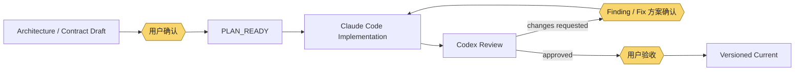
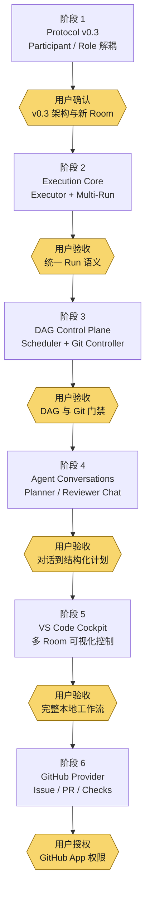

# Agent Room v0.3 阶段路线图与人工控制点

| 属性 | 内容 |
|---|---|
| 文档状态 | Stage 1–3 Accepted history；原Stage 4–6方向已被新路线替代 |
| Owner | Codex |
| 主要读者 | 用户、Codex、Claude Code、人工 operator |
| 创建日期 | 2026-08-29 |
| 生效范围 | Agent Room v0.3–v0.6 演进规划 |
| 关联决策 | [ADR-0003](./ADR/0003-participant-role-and-v03-evolution.md)（Accepted） |

## 1. 结论

用户已要求按六个阶段实现 Agent Room v0.3 路线。该路线替代“长期保持固定 `codex` / `claude` / `runner`、单 Room 单 Run、无专用 UI”的后续产品方向，但在某一阶段完成 Review、用户接受并进入版本化 `main` 前，现有 v0.2 runtime 仍是 Current capability。

每个阶段必须独立经历：



## 1.1 路线替代（2026-09-03）

Stage 1–3历史Accepted成果及现有Agent Room runtime继续有效，不删除任何Room产品能力。原Stage 4 Agent Conversations、Stage 5 VS Code Cockpit、Stage 6 GitHub Provider作为后续方向已被[GitHub/Chat Review新路线](./STAGE_4_GITHUB_CHAT_REVIEW_ARCHITECTURE_REVIEW.md)替代：GitHub成为项目开发持久化交接面，ChatGPT fixed Chat成为正式Review Authority，Codex Cloud负责Plan/Supervisor/Coding，Work只通知。Room SQLite只继续拥有Agent Room产品运行时事实。下文Stage 4–6描述仅保留历史规划背景，不再是Current delivery sequence。

## 2. 总体阶段流



## 3. 阶段责任与人工控制

| 阶段 | 可验收结果 | 计划内人工控制 | 冻结边界 |
|---|---|---|---|
| 1. Protocol v0.3 | Participant、Role、Assignment、generic actor/session、v0.2 只读保留与新 v0.3 Room | Participant enablement、Room 默认角色、未固化 assignment、provider/model config ref、新 binding 确认 | 已创建 Run/Review 的 Participant、历史 Event actor、归档 v0.2、角色权威边界不可改写 |
| 2. Execution Core | Provider-neutral Executor、atomic claim、多个 Run、唯一 terminal state | 未创建 Run 的 Worker、Question/guidance、cancel、new attempt、实时 evidence | 不手工标成功、不改 attempt baseline/worktree、不在运行中换 Worker、不由 Worker执行 Git write |
| 3. DAG Control Plane | immutable TaskGraphRevision、ready scheduling、scope conflict gate、Git Controller | Draft/Amendment dependency、scope、assignment、priority、concurrency 1–3、未派发节点、acceptance policy 与 Git preview | running/reviewing/completed Contract 不改；Accepted revision 不覆盖；冲突 scope 不强制并行；新增 Git write 必须确认 |
| 4. Agent Conversations | PlanningSession / ReviewSession 与结构化 artifact 分离 | 自由规划讨论、显式导出 Draft、Draft 退回、finding/solution/Fix Task 分别确认 | Chat 不自动成为 Accepted artifact；Reviewer 不改 worktree；Worker 不自由 steer；Worker 不自审自收 |
| 5. VS Code Cockpit | multi-root 多 Room 聚合、DAG/chat/run/diff/queue/timeline、snapshot + SSE 恢复 | Room/筛选/布局、合法 action、Draft/Amendment/assignment/concurrency、batch acceptance、retry/cancel/question/Git confirmation | 不写 SQLite、不绕 transition、不执行过期 preview、不在 Webview 直接 shell/Git write；首版不跨 window 调度 |
| 6. GitHub Provider | Room artifact 到 Issue/PR/Check 的单向投影与冲突提示 | App连接、repository与identity mapping、Issue/PR草案、push/PR/merge、冲突处理、Check重试 | GitHub 不接受 Room Task、不替代 Room Review、不绕 acceptance merge；Agent不持有 write token；webhook不直接 transition |

## 4. 分阶段依赖与实现边界

### 4.1 Stage 1 — Protocol v0.3

Stage 1 是 breaking foundation。它只建立 Participant/Role/Assignment、actor/session 泛化、v0.3 persistence 与 route/binding；不同时实现 multi-Run、DAG、Chat、Cockpit 或 GitHub。

当前发现两项必须在 Stage 1 Contract 中明确的顺序问题：

1. 当前开发协调使用 v0.2 Room。必须先由固定在planning baseline的v0.2 launcher worktree驱动Stage 1 Implementation、Review与验收，再执行产品binding切换；不能在Coding前归档这个协调通道或让candidate代码覆盖launcher。
2. `Plan` 与 `Approval` 在当前 v0.2 domain 中不存在。Stage 1 可以冻结未来引用规则，但不得用没有 consumer 的空 entity 伪装已交付能力；Plan-scope assignment 与 Approval lifecycle 在首次真实 consumer 阶段落地。

Stage 1 的已确认方案见 [Increment 9 Accepted Contract](./INCREMENT_9_TASK_CONTRACT.md)。

### 4.2 Stage 2 — Execution Core

依赖 Stage 1 的 frozen participant identity、worker/executor assignment、generic session reference 与 v0.3 binding。首版 WorkerAdapter 为 Claude Code；新的 provider adapter 必须独立验收，不因接口存在而宣称可用。

### 4.3 Stage 3 — DAG Control Plane

依赖 Stage 2 的 atomic RunAttempt 与唯一 terminal state。Scheduler 只消费 Accepted TaskGraphRevision；Git Controller 是全部 Git write 的唯一 product boundary，并且每次 candidate operation 仍须 preview 与用户确认。

### 4.4 Stage 4 — Agent Conversations（Superseded direction）

依赖 Stage 3 的结构化 Draft/Revision。自由 Chat 只生成候选 artifact，服务端验证和用户批准后才形成 Accepted revision。PlanningSession、ReviewSession 与 Worker session 相互独立。

### 4.5 Stage 5 — VS Code Cockpit（Superseded direction）

依赖前四阶段稳定 typed command、snapshot 与 event semantics。Webview 只保存 viewport/filter/selection，不成为 Room state authority。

### 4.6 Stage 6 — GitHub Provider（Superseded direction）

依赖本地 Cockpit workflow 已稳定。GitHub 只持有 external projection；Room SQLite 继续拥有 Plan、Task、Review 与 acceptance。

## 5. Verification 总矩阵

- Participant assignment 解析、capability/role compatibility 与 Run/Review/Event 历史固化。
- v0.2 database 不可被 v0.3 writable service 修改；新 v0.3 Room 与 binding 可恢复。
- DAG cycle、missing dependency、write-scope conflict 与 concurrency `1–3`。
- 两个 Worker 并行，Question/failure/Review gate 只暂停相关子图。
- Executor crash、cancel、retry、new attempt 与唯一 terminal state。
- Plan Amendment immutable revision 与旧 revision replay。
- `per_task` / `integration_only` acceptance policy，以及 Integration Run 后切换拒绝。
- Planner Chat 到 Draft 的显式转换；Reviewer finding、solution 与 Fix Task 三重门禁。
- Git operation preview、授权、cursor validation 与幂等 retry。
- VS Code multi-root 聚合、offline service start、snapshot/SSE reconnect。
- GitHub webhook duplicate、external conflict 与 Room authority 保持。

## 6. 待选功能

下列功能不进入六阶段 baseline；只有 Stage 5 本地窗口稳定后才单独 Architecture Review：

| 优先级 | 功能 | 价值 | 主要代价 |
|---|---|---|---|
| 近期 1 | Event Timeline Replay | 回放 Plan 为何进入当前状态 | 历史投影与播放控制 |
| 近期 2 | Side-by-side Diff Review | 对比 baseline、candidate 与 Fix | Diff 渲染复杂度 |
| 近期 3 | Cost/Token panel | 展示 Agent、Task、Plan 成本 | Provider usage 口径不统一 |
| 近期 | Plan/Task template、Room export、status bar summary | 复用、审计与快速提醒 | 版本、隐私过滤与通知降噪 |
| 中期 1 | Machine-level Room Hub | 跨 VS Code window 聚合与全局并发 | 中央常驻服务与新权威边界 |
| 中期 2 | Remote Worker Host | 远程机器或容器执行 | 认证、传输、远程 worktree |
| 中期 3 | Multi-reviewer / quorum | 关键 Task 独立复审 | 冲突与最终裁决 |
| 中期 | Competing Candidates、automatic retry、graphical DAG editor、notification connector | 候选比较、恢复、交互与外部通知 | 成本、调度矩阵、权限与同步 |
| 远期 | Free Worker chat、automatic Fix、automatic merge、cross-repository DAG、capability routing、pluggable Scheduler、Web Cockpit | 更高自动化与扩展性 | 与人工门禁、权限、部署和状态机复杂度冲突 |

推荐顺序：

```text
Event Timeline Replay
→ Side-by-side Diff Review
→ Cost/Token panel
→ Machine-level Room Hub
→ Remote Worker Host
→ Multi-reviewer
```

`Competing Candidates`、free Worker chat、automatic Fix 与 automatic merge 保持远期候选，不与首版 multi-Worker DAG 混合交付。
