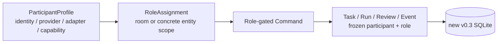

# Agent Room 架构

> 状态：Current  
> 批准日期：2026-08-23  
> 范围：本地单用户 MVP

## 1. 系统上下文

Agent Room 协调用户、Codex App、Claude Code CLI、Git 与 VS Code 之间的串行协作工作流。

```text
用户 ↔ Codex App
        │
        │ 显式调用 Room MCP
        ▼
┌──────────────────────────────┐
│ Local Agent Room Service     │
│                              │
│ State Machine                │
│ SQLite Repository            │
│ Task / Review / Question     │
│ Claude Runner                │
│ Git Observer                 │
│ MCP Interface                │
│ Status CLI                   │
└──────────────┬───────────────┘
               │ 每个 Run 启动一次
               ▼
       Claude Code CLI
               │
               ▼
       Shared Git Worktree
               │
               ▼
        VS Code Git Diff
```

Codex App 保持为用户讨论、方案规划和 Review 界面。VS Code 保持为代码和 Diff 界面。Agent Room 不引入新的通用聊天室 UI 或编辑器。

## 2. 架构原则

1. 每类核心状态只有一个所有者。
2. 状态转换是行为约束，不是显示标签。
3. Runner 观察到的事实优先于模型自述。
4. 首版保持本地、串行且可直接检查。
5. MCP 只暴露协调能力。
6. Task Contract 是已批准设计与 Coding 实现之间的边界。
7. Review finding 在用户确认前不得转化为 Fix Task。

## 3. 模块边界

### 3.1 Room Service

负责进程启动、模块组装和本地生命周期。它在 loopback 上暴露 Room MCP endpoint，并协调 Runner 事件与持久化状态。

它不拥有源代码内容，也不编辑目标项目。

### 3.2 State Machine

每次 Room 状态转换都必须校验：

- 当前状态；
- 请求 actor；
- 引用的 Task、Review、Question 或 Run；
- 必需的用户确认门禁；
- 当前 active Run。

只有该模块可以修改 `rooms.state`。

### 3.3 SQLite Repository

持久化 Room、Task Contract、Run、Review、Question 和 Event。SQLite 是协作状态的权威存储。

Repository layer 负责 entity 创建和状态转换的 atomic transaction，不把记录镜像为 JSON 文件。

### 3.4 Claude Runner

负责 Claude CLI process 与 session 生命周期：

- 每个 Run 创建一个 process；
- 从已批准 Task Contract 构造 prompt；
- 传入 Room MCP 配置；
- 读取 structured CLI event；
- 记录 session ID 和 final result；
- 处理退出、中断和无效输出；
- 请求 Git Observer 获取实际完成证据；
- 请求对应的 Room 状态转换。

Runner 不决定需求、架构或 Review finding。

> Current implementation（`main` commit `e8f0da6db9f3f4ff426355fa1a84d19bae4db9f2`）：central Runner 由 `claude-runner.ts` 组合两个 accepted leaf —— `claude-process.ts`（process transport）与 `claude-stream.ts`（stream interpreter）—— 并调用 `RoomService`/Git Observer/artifact。terminal transition 通过 `RoomService.completeRun`/`failRun` 的 `RunTerminalEvidence` 在同一 SQLite transaction 内持久化 `claude_session_id`、`process_exit_code`、`git_evidence` 与 `artifact_refs`；非终态 stdout line 经 `appendRunProgress` 追加 `run_progress` Event 而不改变状态。failure mapping 由 Runner 单一 settle：`claude_start_failed` > `claude_exit_failed` > `room_mcp_unavailable` > `coding_result_invalid` > `git_evidence_failed` > `artifact_write_failed`。`CODING` 从 `startRun`/`resumeRun` atomic claim 开始，覆盖 process startup 与 MCP initialization。

### 3.5 Git Observer

使用 Git CLI 进行只读仓库检查：

- 确认目标是 Git repository；
- 在新 Implementation Task 前强制 clean worktree；
- 记录 `baseline_head`；
- 收集 staged、unstaged 和 untracked 状态；
- 为 Codex Review 生成 metadata。

它不执行 commit、stage、reset、checkout、clean 或 restore。

### 3.6 MCP Interface

把已认证的本地 tool call 映射为 application command。它校验 tool input 和 actor 权限，然后委托 State Machine 与 repository。

它不暴露通用 `read_file`、`write_file`、`apply_patch`、`bash`、`git_diff` 或 `git_commit` tool。

### 3.7 Status CLI

提供 operator 可读的状态：

- active Room 和 state；
- 当前 Task 与 Run；
- 等待中的 actor；
- 待处理 Question；
- 最近 Run outcome；
- changed-file summary 信息。

CLI 读取 Room 状态。除非后续已批准需求明确增加，否则它不创建第二条状态转换路径。

### 3.8 Increment 4 Current implementation

[Increment 4 Task Contract](./INCREMENT_4_TASK_CONTRACT.md) 已于 2026-08-25 获用户确认；Claude Coding 与 Fix Task 1–3 已完成、通过 Review 并获用户接受，`src/mcp/`、`src/cli/` 与 `src/room/state-snapshot.ts` 已把以下接口纳入版本化 `main` baseline：

- 同一 local process 与 SQLite authority 暴露 `/mcp/codex`、`/mcp/claude` 两个 stateless Streamable HTTP JSON-response route；前者只注册五个 Codex tool，后者只注册 `room_ask_question`，不信任 caller 自报 actor。
- MCP `room_get_state` 与 Status CLI 共用一个只读 Room state snapshot application boundary；current entity 由最新相关 Event reference 决定，waiting actor 使用固定 Room-state mapping。
- 首次 `type=implementation` 的 `room_submit_task` 在 existing-ID retry/conflict 判断后调用既有 Git Observer clean gate；Fix Task 不重新建立 baseline。
- runtime 固定监听 `127.0.0.1` 并显式接收 database、project 与 port；MVP 不增加 remote auth、SSE、stateful MCP session、scheduler 或 daemon manager。

这些设计保持 State Machine、SQLite、Git 与 Runner ownership 不变。Fix Task 1–3 已直接覆盖 JSON response、request resource cleanup、write-tool durable rollback、review/question retry/conflict，以及 `room_submit_review` 对 stale succeeded Run / wrong-current 的 MCP public path。Codex Review `review-increment-004-codex-004` 无 finding，Decision 为 `approved`；`npm run typecheck`、MCP 27/27 与全量 186/186 均通过。用户已明确接受并授权提交，bootstrap transport 已 `Superseded`；Room MCP、Status CLI 与 runtime command 现为版本化 Current capability。

### 3.9 Increment 5 Current implementation — Decision/Fix continuation

[Increment 5 Accepted Contract](./INCREMENT_5_TASK_CONTRACT.md) 已获用户确认，冻结一个不改变组件所有权的最小 continuation wiring：

- `room_ask_question` 继续原子保存 Question并把 Room/Run置为 `NEEDS_DECISION`；Claude process结束后由 Runner 在同一 needs-decision Run上补交 session、exit、result/failure、Git、artifact与 `completed_at`，再追加 `run_paused` Event。该 Event 使 cursor consumer 能区分“Question已保存”与“旧 process已停止”。
- `answerQuestion` 只在 source Run 已完成 pause finalization 后接受答案，防止用户过早回答后启动 resume process，形成两个 process并行修改同一 worktree。
- Decision continuation 通过 current answered Question引用的 source Run推导 session/baseline；Fix continuation 通过 current Fix Task的 `based_on_review_id` 指向的 reviewed Run推导。caller不拥有 resume session或baseline。
- 新 Implementation lineage仍要求 clean worktree；Decision/Fix continuation保留已有 staged/unstaged/untracked changes，只读验证 owning worktree、unchanged `HEAD` 与 inherited baseline。

本 Accepted design不新增 Room state、transition、entity、SQLite field/table、MCP tool、source module、dependency、Runner daemon或 scheduler。[Increment 5 Fix Task 1](./INCREMENT_5_FIX_TASK_1.md) 已按确认方案修复 progress routing、已完成 finalization 的 retry/conflict 顺序与 deterministic fake-process isolation；test-only [Fix Task 2](./INCREMENT_5_FIX_TASK_2.md) 已补齐 Contract 点名的 event-order 与 durable zero-side-effect Oracle，未修改 source。Review `review-increment-005-codex-003` 无 finding，用户已明确接受并另行授权提交完整 accepted scope；实现现已进入版本化 `main`，且未产生新的 architecture、state ownership 或 runtime command。

### 3.10 Increment 6 Current implementation — End-to-End MVP Runtime

[Increment 6 Accepted Contract](./INCREMENT_6_TASK_CONTRACT.md) 已于2026-08-26获用户确认并冻结以下wiring；从clean exact `main` baseline（dispatch `HEAD`=`7ac639a30ab2a94170ef69498e065fb16e77f833`）重新执行的完整Implementation Task已完成Review、用户接受与版本化提交：

- `/mcp/codex` 在既有五个tools上增加`room_create`、`room_begin_architecture_review`、`room_request_user_confirmation`与`room_retry_run`，只适配现有`RoomService` commands；`/mcp/claude`仍只公开`room_ask_question`。
- 新增显式one-shot `room:run` operator boundary。它打开既有file-backed SQLite，验证project/current Task/MCP endpoint后执行恰好一个Run；它不创建Room、不启动server、不轮询、不调度下一Run。
- 首次Implementation仍由caller提供并通过clean exact baseline gate。Decision、Fix和failure retry都从persisted source Run继承baseline；failure retry保留dirty worktree，session存在时exact `--resume`，session缺失时在同一Task lineage启动replacement session。
- 端到端验收穿过真实loopback MCP、file-backed SQLite与representative Git repository，并在Runner application boundary替换为deterministic fake Claude process；由此验证product wiring而不依赖paid process或外部network。

该设计继续保持SQLite/State Machine的durable state ownership、Git Observer只读边界、process-per-Run、Task-lineage session、Runner-owned terminal settlement与Codex explicit pull。不增加Room state/schema/Event/error/dependency、daemon、automatic retry、Git mutation或Increment 7 packaging。

clean-baseline re-execution已按该Accepted design形成Current implementation：`/mcp/codex`注册九tools，`/mcp/claude`仍为一个`room_ask_question`；one-shot`room:run`与failure`retry` continuation已落地，端到端acceptance/failure recovery（含source session为空时的同lineage replacement session）以fake-process boundary穿过真实MCP/SQLite/Git通过。[Increment 6 Fix Task 1](./INCREMENT_6_FIX_TASK_1.md)已补齐missing/non-failed/non-terminal current-task source的Runner direct regression，三类测试均在既有guard下通过，production source未改动；旧Task failed Event仍表示新current Task无source，stale caller仍拒绝。Review `review-increment-006-codex-003`无finding、Decision为`approved`；用户已明确接受并另行授权提交完整accepted scope，实现现已进入版本化`main`。

### 3.11 Increment 7 Accepted target design — Plugin 与多项目独立部署

用户于2026-08-27确认以下target architecture及[Increment 7 Accepted Contract](./INCREMENT_7_TASK_CONTRACT.md)全部实现范围；本节不表示Plugin已实现：

```text
                         install once
Codex App ───────────── Agent Room Plugin
                           │ shared Skill
              ┌────────────┴────────────┐
              │                         │
Project A .codex/config.toml    Project B .codex/config.toml
Project A runtime.json          Project B runtime.json
              │                         │
Room service A / DB A / port A Room service B / DB B / port B
worktree A / Claude A          worktree B / Claude B
```

- Plugin只封装稳定的Codex workflow/Skill，不拥有Room runtime state，也不硬编码project-specific endpoint、database、path、Room或approval policy。
- 每个项目由project-scoped `.codex/config.toml`选择自己的`/mcp/codex` loopback endpoint，并以local-only `.agent-room/runtime.json`保存one-shot command所需的`agent_room_root`、`database_path`、`project_path`、`port`与`room_id`。该具体文件格式已纳入Accepted Contract。
- Project A/B各自启动Room service并拥有独立SQLite、Git worktree、artifact tree和Claude process，可跨项目并行；它们不共享Room transaction、Event cursor、Task lineage或active Run。
- `room:run`保持one-shot operator-authorized boundary；Increment 7 Plugin workflow的caller固定为Codex，host内部审批模式固定为UI“帮我批准”（`approvals_reviewer=auto_review`）。`auto_review`通过时Codex只执行一次，拒绝时停止并报告；Plugin不创建或修改active approval/rule，也不把operator direct run作为fallback。Current CLI的人工可调用性不因packaging改变。
- 首次Implementation baseline沿用Current MCP边界：只接受首次成功`room_submit_task`响应返回的`observed_baseline_head`。它未进入Room snapshot；Skill必须在同一workflow step生成并保留exact command，丢失时fail closed，不以live HEAD猜测或建立本地baseline mirror。Decision/Fix/retry仍由persisted source Run拥有baseline。
- 同一Room仍保持single active Run，不引入queue、scheduler、daemon、automatic wakeup/retry或parallel Run。

该拓扑只增加Codex packaging和project binding，不改变Room Service、State Machine、SQLite Repository、Runner、Git Observer或MCP transport的production dependency direction。

#### 3.11.1 Increment 7 严格重执行 implementation facts（2026-08-27）

按[Increment 7 Accepted Contract](./INCREMENT_7_TASK_CONTRACT.md)从 clean documentation baseline 严格重执行已落地以下实现；以下事实已由 Review 5、用户接受和版本化 `main` commit `97005f54555f6485c79f15860a58fe79c3ed593d`确认，未修改`src/`或production runtime：

- `plugins/agent-room/.codex-plugin/plugin.json`声明唯一Plugin（`name`=`agent-room`、`version`=`0.1.0`、`skills`=`./skills/`），无hooks/App/MCP bundle/assets/dependency与静态`.mcp.json`；`plugins/agent-room/skills/agent-room/SKILL.md`是全仓库唯一authoritative Skill，`references/project-setup.md`只含placeholder模板。
- `.agents/plugins/marketplace.json`经Fix重写为Codex当前repository marketplace嵌套schema；`references/project-setup.md`补齐project-scoped config/runtime/gitignore模板；Skill的baseline authority、stable fresh `run_id`、quoted one-shot launcher、approval与post-run reread也已按Review 2方案修正。
- Review 3 `review-increment-007-codex-003`确认两个剩余阻塞：唯一`SKILL.md`缺少Codex Skill所需YAML front matter；`room_answer_question(answer_changes_contract=false)`后durable Room仍为`NEEDS_DECISION`，但Skill Step 4把launcher限制为`PLAN_READY`/`FIX_PLAN_READY`，与Current Decision resume lifecycle矛盾。该finding不改变本节target architecture或production dependency direction。
- Fix Coding Result报告`tests/plugin-packaging.test.ts` 16/16、`tests/multi-project-e2e.test.ts` 1/1、`tests/scope.test.ts` 1/1、typecheck与全量259/259通过；现有packaging Oracle未直接覆盖上述front matter与`NEEDS_DECISION` resume组合语义。
+ 用户已确认Review 3两项finding与最小方案，[Increment 7 Fix Task 2](./INCREMENT_7_FIX_TASK_2.md)为`Accepted`/`FIX_PLAN_READY`：只补齐Skill discovery front matter、对齐既有Decision continuation state gate并增加packaging direct Oracle，不改变本节target architecture或production dependency direction。用户选择人工派发；该Fix随后完成Review与接受。
- Fix Task 2 Coding已把answered `NEEDS_DECISION` continuation纳入Step 4并补充front matter/组合Oracle；Review 4 `review-increment-007-codex-004`确认Decision lifecycle已对齐，但未加引号的front matter `description`包含`binding: validate`，标准YAML parser拒绝该mapping，测试侧局部parser未覆盖真实YAML scalar规则。用户已确认finding与最小方案，[Increment 7 Fix Task 3](./INCREMENT_7_FIX_TASK_3.md)已完成Coding；Review `review-increment-007-codex-005`独立验证无finding、Decision为`approved`，用户已明确接受，已进入版本化 `main` commit `97005f54555f6485c79f15860a58fe79c3ed593d`；Fix 3仅修正description scalar表示和对应negative Oracle，不改变target architecture、production dependency direction或protocol version，Plugin与多项目配置现为Current capability。

### 3.12 Increment 8 Accepted target — Automatic Project Setup

> 状态：Current / Fix Review 3 `approved` / 用户已最终接受 / `ACCEPTED` / main commit `8428046dded5f7542690735b3df8a5c5490e8090`。权威范围见[Increment 8 Accepted Contract](./INCREMENT_8_TASK_CONTRACT.md)与[Fix Task 2](./INCREMENT_8_FIX_TASK_2.md)。

```text
operator provides agent_room_root once
                 │
                 v
existing Agent Room Skill setup mode
                 │
                 v
Skill-owned helper ──> runtime.json + project MCP config + .gitignore
                 │       database / port / room_id generated locally
                 v
existing room:serve ──> Codex Desktop reload boundary
                              │
                              v
                    project-scoped room_create
                              │
                              v
                    room_get_state = DISCUSSION
```

- setup是现有唯一Skill的显式模式，不是Room lifecycle state或第二持久化authority；普通workflow不得因binding缺失而静默进入setup。
- operator首次只提供absolute `agent_room_root`；`project_path`来自当前workspace，`database_path`固定为project-local SQLite path，`port`由OS loopback ephemeral allocation生成，`room_id`使用`room-<UUID>`。
- Skill-owned TypeScript helper只负责确定性校验、生成与保守文件合并。Room schema仍由existing`room:serve`拥有，Room entity仍由existing`room_create`拥有；helper不写SQLite。
- service启动前探测binding port：已开放时不启动第二个process，关闭时启动一次existing`room:serve`。该probe只避免明显重复启动，Room identity最终由reload后的project-scoped MCP验证；不新增PID registry、service manager、daemon或health scheduler。
- `.codex/config.toml`加载形成明确reload boundary。reload前只建立binding并启动service；reload后只用project-scoped `room_create`/`room_get_state`创建或复用exact Room。setup完成后停止，不进入Architecture Review、Task、`room:run`或Claude。
- invalid existing binding、config conflict或runtime/config mismatch在任何写入前停止；valid rerun复用全部identity。该deployment convenience不改变Room Service、State Machine、SQLite、Runner、Git Observer、MCP transport或protocol version。
- 用户已于2026-08-27授权提交Accepted planning范围并选择人工派发；Implementation Coding已从clean `main` exact `HEAD` `0872dda067c6af4d7333c58da8d9ac2a967acce2`完成。Review `review-increment-008-codex-001`定向复现标准TOML dotted-key `mcp_servers.agent_room.url`已存在、runtime缺失时，helper仍exit 0、创建runtime/gitignore并追加第二个agent_room table，破坏Contract的conflict-before-write/zero-write invariant；focused setup仍9/9，证明该public input未覆盖。actual installed-plugin Skill consumer evaluation亦未运行，测试侧parser不能替代真实consumer evidence。Decision为`changes_requested`。
- 用户已确认两项finding及最小方案，[Increment 8 Fix Task 1](./INCREMENT_8_FIX_TASK_1.md)为`Accepted`/`FIX_PLAN_READY`：只在existing helper classifier识别冻结的agent_room/other-server dotted URL assignment并增加public CLI zero-write regression；packaging parser只保留offline metadata子集证据，真实activation/resource resolution由另行授权的installed-plugin evaluation验收。不引入generic TOML parser/dependency，不改变本节Accepted architecture、Room authority或production dependency direction。
- Fix Task 1 Coding已完成；Fix Review 2 `review-increment-008-codex-002`独立验证focused setup 10/10、packaging 20/20、scope 1/1、typecheck与全量273/273通过，并确认offline parser已准确声明其证据边界。但dotted classifier按整份文件逐行匹配而未跟踪TOML当前table；public helper CLI对`[unrelated]`下的嵌套`mcp_servers.agent_room.url`返回`runtime binding is missing`，而独立TOML parser显示该key属于`unrelated.mcp_servers.agent_room.url`。Decision为`changes_requested`；actual installed-plugin consumer evaluation仍为`not_run`。该finding不改变Accepted architecture、Room authority或production dependency direction。
- 用户已确认Fix Review 2 finding与最小方案，[Increment 8 Fix Task 2](./INCREMENT_8_FIX_TASK_2.md)为`Accepted`/`FIX_PLAN_READY`：只让existing narrow classifier保留判断冻结dotted assignment是否位于TOML top-level所需的最小table context，并补unrelated-table public CLI direct regression。Skill/helper、Room authority、reload lifecycle、production dependency direction与protocol version均不改变；actual installed-plugin consumer evaluation仍需另行授权。
- Fix Review 3 `review-increment-008-codex-003`确认该table-context修复与public CLI regression无finding，focused/full自动化验证通过。用户随后授权local marketplace registration、candidate install与actual installed-plugin consumer evaluation；installed cache与workspace Plugin逐文件一致，fresh tasks中的direct/indirect setup、missing-binding normal workflow、unsupported request与bundled helper/reference resolution全部符合预期，故Decision更新为`approved`。用户于2026-08-28明确最终接受，完整accepted scope由commit `8428046dded5f7542690735b3df8a5c5490e8090`进入版本化`main`，automatic setup现为Current capability。这不改变Accepted architecture、Room authority、reload lifecycle、production dependency direction或protocol version。

### 3.13 Current implementation — Protocol v0.3 Participant / Role Foundation

> 状态：Current / 已进入版本化`main` / active project runtime已于2026-08-30完成独立授权的v0.3 database/binding cutover。当前project Room为`DISCUSSION`，仍保持single active Run与人工授权边界；fixed actor与v0.2 dual route不再是active runtime authority。

Fix Review 2的direct public-path evidence曾确认candidate尚未闭合完整frozen authority：production Runner仍以固定`local-runner`执行resolved Task-scope executor Run；`acceptReview`仍按Room default而非Task-scope/frozen reviewer授权；Task/Run/Review在assignment replacement后无法合法same-ID retry；被替换orchestrator仍可通过historical assignment管理Participant；setup复用只要求非空`control_participant_id`却固定生成`codex-app` URL。用户确认的最小方向已由Fix Task 2及后续Fix闭环（见§3.13.2–3.13.4）；该段保留为Review历史，不再描述Current缺口。

v0.3 Stage 1把identity与authority分离，但不提前实现Stage 2–6：



- `ParticipantProfile`拥有identity和adapter metadata；secret只通过opaque `config_ref`引用。
- `RoleAssignment`拥有future routing；entity创建时把resolved participant/role固化到历史entity/Event。
- v0.3 MCP route为`/mcp/participants/p~{encodeURIComponent(raw participant_id)}`（不再有`/mcp/codex`、`/mcp/claude`或unframed alias），`p~`仅是single-segment transport framing；tool自身冻结required role，caller不能用参数声明authority。
- v0.3使用new database与new binding；v0.2 database保持原内容、原路径并在cutover后只读保留。
- Stage 1默认adapter仍是Codex App、Claude Code CLI与local Runner，串行lifecycle和Git只读/人工授权边界保持不变。
- `Plan`、`Approval`、multi-Run、DAG、Scheduler、Git Controller write、Chat、SSE/UI与GitHub不在Stage 1创建空implementation；它们在首个真实consumer阶段交付。

#### 3.13.1 Increment 9 candidate implementation facts（2026-08-29，Implementation + Fix 1 Coding 完成，待 Review）

按[Increment 9 Accepted Contract](./INCREMENT_9_TASK_CONTRACT.md)在target main worktree完成的candidate实现（尚未Review/接受，未进入版本化`main`）：

- `Role`枚举冻结为`planner`/`worker`/`reviewer`/`executor`/`git_controller`/`orchestrator`；`EventActor`={participant_id, actor_role}。protocol version为`0.3-design`。
- `createRoom` bootstrap四个Participant profile（codex-app/planner+reviewer+orchestrator、claude-code-cli/worker、local-runner/executor、operator/human无assignment）与五条room-scope assignment；planner身份caller才能创建Room。codex-app是project single control endpoint participant（capabilities含planning/reviewing/supervising），binding的`control_participant_id`与MCP URL直接指向codex-app；operator保留human profile但无active assignment（Review finding inc9-r4）。
- 新v0.3 database由repository version gate管理：全空表fresh建schema并写`protocol_metadata`；已有表但无metadata的v0.2 archive拒绝schema write；version不exact拒绝。
- Task提交时固化planner/orchestrator、Run claim时固化worker/executor、Review提交时固化reviewer；历史identity来自当时resolved assignment，assignment变更（register/enable-disable/replace）不改写既有Run/Review/Event。
- Run/Review的worker/executor/reviewer按run/review.task_id的Task scope优先、Room default fallback解析（Review finding inc9-r2）；Task提交继续使用Room planner/orchestrator。Stage 1 scope收窄为room|task，不暴露run/review scope。
- 已创建Run的askQuestion/progress/pause finalization/complete/fail只对照Run冻结的worker/executor identity：replacement actor对旧Run返回actor_not_allowed，disabled冻结actor必须re-enable后恢复（Review finding inc9-r1）。
- assignment resolution：room scope必须scope_id=null，task scope必须引用同Room已存在Task；同scope/role active只由成功insert的rowid顺序决定（rowid DESC），不信任caller created_at；same-ID retry不产生新row、不提升旧assignment；participant须存在、enabled且adapter/capability与role兼容，否则在entity/Event创建前拒绝并rollback（Review finding inc9-r5）。
- `git_controller`兼容规则冻结为adapter_id=local_runner且capability=git_control的enabled participant；bootstrap不创建git_controller assignment，Stage 1不执行Git command write（Review finding inc9-r5）。
- MCP只暴露framed `/mcp/participants/p~{encodeURIComponent(raw participant_id)}`单一route；route恢复raw participant identity，13个tool各自绑定planner/reviewer/worker/orchestrator frozen role并经assignment校验；unknown/disabled/unassigned/role-incompatible caller拒绝。
- Run字段`claude_session_id`改名为`agent_session_ref`（opaque nullable）；Runner exact `--resume` lineage语义不变。
- setup binding扩展为八字段（五字段+`protocol_version`+`control_participant_id`+`archived_database_path`）；v0.2五字段binding只作为migration archive输入，migration创建`room-v0.3.sqlite`与新room_id、复用port、保守改写v0.2 `/mcp/codex` URL到participant route。Fix 1 public CLI direct regression证明：旧database逐byte不变（helper从不打开旧database）、rerun mode=reused且identity稳定、config conflict零写入（Review finding inc9-r6）；version gate经room:serve public open路径证明缺metadata的v0.2 archive与wrong exact metadata在schema/state write前以`protocol_version_mismatch`拒绝且bytes不变。
- v0.2 `agent_room_root`（stored指向v0.2代码如detached launcher）不能作为v0.3 root：migration/reuse要求operator再提供一次`--agent-room-root`（最小选择，见Coding Result deviation）。
- 既有v0.2 database未迁移、未backfill、未删除，通过`archived_database_path`只读保留；active project runtime已使用v0.3 database、八字段binding与framed participant route。

Stage 1修改runtime自身，因此candidate开发执行由固定planning baseline的detached v0.2 launcher worktree驱动当前target main/Room；candidate只修改target，不覆盖后续Fix/Decision所加载的launcher代码。这只隔离development，不构成产品worktree manager。详细决策见[ADR-0003](./ADR/0003-participant-role-and-v03-evolution.md)。

#### 3.13.2 Fix Task 2 Coding facts（2026-08-29，candidate，Fix Review 3 已完成）

按[Increment 9 Fix Task 2](./INCREMENT_9_FIX_TASK_2.md)在§3.13.1基础上闭环的五项confirmed finding（`review_fixes_only`，未扩大Stage 1范围）：

- Runner是executor authority的consumer：`runClaude`从resolved executor assignment（Task scope优先、Room default fallback）构造`executorActor`，并贯穿startRun/resumeRun claim、appendRunProgress、finalizeNeedsDecision、completeRun与failRun；service claim校验与terminal command共享同一冻结executor identity，不回退固定`local-runner`（inc9-fr2-1）。
- `acceptReview`先校验route Participant存在、enabled、actor_role=reviewer，再对照Review提交时冻结的`reviewer_participant_id`；assignment replacement不转移既有Review acceptance权，disabled冻结reviewer re-enable后恢复（inc9-fr2-2）。
- Task/Run/Review same-ID retry先识别existing entity，再按stored冻结的planner/executor/reviewer identity认证；caller-owned contract与stored server-resolved身份分层比较（不再用current assignment augment existing content）。authorized same-content retry返回`created=false`且零写入，different content保持`id_conflict`，replacement/unknown/disabled/wrong-role返回`actor_not_allowed`；new entity继续解析current assignment并固化identity（inc9-fr2-3）。
- Participant管理的orchestrator检查使用database-level `isActiveLatestAssignment`：同(room_id, scope_type, scope_id, role)组内只有rowid最新的assignment授权；被新assignment替换的historical orchestrator立即失去管理authority，重新成为active后恢复（inc9-fr2-4）。
- existing v0.3 binding只在`control_participant_id` exact为`codex-app`时复用，expected MCP URL由同一validated identity构造；mismatch在runtime/config/gitignore任何写入前失败且三份文件逐byte不变（inc9-fr2-5）。
- direct regression：非默认Task-scope executor穿过真实`runClaude` claim与terminal settlement；frozen Task-scope reviewer接受其Review而replacement/Room default被拒；三类replacement-safe same-ID retry与historical orchestrator拒绝零写入；control identity mismatch public CLI零写入。
- 验证事实：typecheck exit 0；claude-runner/room-service 114/114；room-mcp/plugin-setup 51/51；scope 1/1；full 309/309；`git diff --check`无错误。未新增source module、dependency、schema field/table或Git写操作；Stage 2–6能力未混入。

#### 3.13.3 Fix Review 3 与 Accepted Fix Task 3（2026-08-29）

- Fix Task 2的五项confirmed finding已闭合，Codex独立验证typecheck、focused 114/114与51/51、scope 1/1、full 309/309及Diff检查通过。
- 剩余阻塞在dynamic participant route：公开`ParticipantProfile.participant_id`只要求非空，允许`worker/2`等opaque identity；`runClaude`与`room:run` CLI却把raw identity直接拼入`/mcp/participants/{participant_id}`并按raw pathname比较。实际HTTP probe显示raw `/mcp/participants/worker/2`为404，`/mcp/participants/worker%2F2`可命中route，但当前Runner/CLI comparison拒绝encoded pathname。
- 因而可成功注册、分配且兼容的Participant仍可能没有可达MCP route。用户已确认最小方向并形成Accepted [Fix Task 3](./INCREMENT_9_FIX_TASK_3.md)：raw `participant_id`仍是唯一durable identity；完整identity仅在HTTP boundary执行canonical URI component encoding，MCP route param恢复raw identity供authority使用；MCP、production Runner与public CLI以`worker/2`提供direct regression。该Fix不改变Participant schema、assignment authority或Stage 1范围；未授权Run、accept或Git write。

#### 3.13.4 Fix Task 3 Fix Coding facts（2026-08-29，candidate，待 Fix Review 4）

按[Increment 9 Fix Task 3](./INCREMENT_9_FIX_TASK_3.md)闭环confirmed finding `inc9-fr3-participant-route-segment`（`review_fixes_only`，未扩大Stage 1范围）：

- `participant_id`保持raw opaque identity与公开schema；HTTP path segment只是transport encoding，不是新identifier或authority source。`/mcp/participants/{participant_id}`的URL representation把完整raw identity用`encodeURIComponent`折叠为恰好一个canonical URI segment（如`worker/2`→`worker%2F2`），不逐部分编码、不保留raw slash、不double-encode。
- `runClaude`与`room:run` CLI各自从同一resolved worker assignment的raw identity独立构造canonical encoded route，并用`new URL(...).pathname`的exact comparison验证mcpConfig/mcp-url；raw多segment、未编码、错误participant、尾斜杠、query与fragment继续在spawn/claim前拒绝。Room authority仍接收raw identity。
- MCP route本身不改动：Express框架把匹配到的encoded segment解码回raw route param，application authority不做第二次decode；无wildcard/catch-all、legacy alias或多segment fallback。
- direct regression（期望值均为测试侧literal，未从production route builder导出）：MCP public path经`/mcp/participants/worker%2F2`调用`room_ask_question`成功且Event actor为raw `worker/2`/worker，raw `/mcp/participants/worker/2`返回404且Event list零变化；production `runClaude`以`worker/2` Task-scope worker穿过route gate、claim与`run_completed` terminal settlement（Run冻结raw identity），raw多segment mcpConfig在spawn/claim前`validation_failed`且零副作用；public `room:run` CLI以canonical encoded mcp-url完成fake-process Run，raw多segment URL preflight失败且完整durable read-model snapshot逐字段不变。
- 验证事实：typecheck exit 0；claude-runner 49/49；runner-cli 15/15；room-mcp 38/38；scope 1/1；full 314/314；`git diff --check`无错误。未改变schema、database、protocol version、Stage 2–6、dependency或source module，未执行Git写操作。

#### 3.13.5 Fix Review 4 与 Accepted Fix Task 4（2026-08-29）

- Fix Review 4确认Fix Task 3对`worker/2`的single-segment encoding、raw authority恢复与Runner/CLI exact gate实现正确；独立typecheck和full 314/314通过。
- remaining invariant：`participant_id`仍允许`.`与`..`，而`encodeURIComponent`保留dot；WHATWG URL parser会在请求到达MCP前把对应route归一化为当前/父路径，因此合法Participant仍不可达。
- 用户已确认[Fix Task 4](./INCREMENT_9_FIX_TASK_4.md)：所有v0.3 participant routes统一使用`p~` + `encodeURIComponent(raw participant_id)`。固定prefix使segment永不等于dot segment；MCP framework完成URI decode后，application只验证并移除一次prefix，剩余值继续作为raw authority identity。
- framing适用于MCP、Runner、CLI、setup-generated control URL与Plugin workflow；default control/worker URL变为`/mcp/participants/p~codex-app`与`/mcp/participants/p~claude-code-cli`。未加前缀的old candidate route直接拒绝，不增加compatibility route或schema restriction。
- 状态为candidate / `FIX_PLAN_READY`。本次只确认Contract，不授权Run、accept、Git write、database/binding cutover或旧数据删除；Current v0.2 `/mcp/codex` authority不变。

#### 3.13.6 Fix Task 4 Fix Coding facts（2026-08-29，candidate，Fix Review 5 approved）

按[Increment 9 Fix Task 4](./INCREMENT_9_FIX_TASK_4.md)闭环confirmed finding `inc9-fr4-dot-segment-normalization`（`review_fixes_only`，未扩大Stage 1范围）：

- `participant_id`保持raw opaque identity与公开schema；所有v0.3 participant route的canonical single transport segment统一为`p~` + `encodeURIComponent(raw participant_id)`（`.`→`p~.`、`..`→`p~..`、`worker/2`→`p~worker%2F2`、default→`p~codex-app`/`p~claude-code-cli`）。固定`p~` prefix使segment永不等于dot segment，WHATWG dot-segment normalization不再改变pathname。
- MCP POST route（`src/mcp/http.ts`）：framework对匹配segment只做一次percent-decode；application只验证并移除恰好一次`p~` prefix，剩余值直接作为raw authority identity（不二次percent-decode）。unframed单segment POST返回404 JSON-RPC error，不注册tool、不进入participant authority；无legacy alias/wildcard/catch-all/dual-route fallback。GET/DELETE维持对任何单segment一律405。
- `runClaude`与`room:run` CLI各自从同一resolved worker assignment的raw identity独立构造framed route，并用`new URL(url).pathname` exact comparison验证mcpConfig/mcp-url；`p~`只存在于transport segment，claim/Event/Run的identity字段保持raw。raw多segment、unframed encoded、错误participant、尾斜杠、query与fragment继续在spawn/claim/Event/artifact前拒绝。
- setup-project从validated `control_participant_id`生成framed control URL；既有config的旧unframed candidate URL（如`/mcp/participants/codex-app`）既非framed expected URL也非v0.2 `/mcp/codex` legacy URL，由planConfig既有exact-match分支按binding/config mismatch在任何写入前拒绝（无auto-compat migration/rewrite）。Plugin SKILL/reference与packaging Oracle全部切换为framed route。
- direct regression（期望值均为测试侧literal framed route，未从production导出framing helper/constant）：MCP public path注册并分配`.`/`..`后经`/mcp/participants/p~.`与`/mcp/participants/p~..`调用实际`room_ask_question`成功，Event actor与Run冻结均为raw identity；unframed `.../mcp/participants/.`/`.../mcp/participants/..`被WHATWG URL归一化出participant route，POST 404且Event list零变化。production `runClaude`以`.`/`..` Task-scope worker穿过route gate、claim与`run_completed` terminal settlement（Run冻结raw identity），unframed encoded mcpConfig在spawn/claim前`validation_failed`且零spawn/Run/Event/artifact。public `room:run` CLI以framed `p~.`/`p~..` mcp-url完成fake-process Run，unframed URL preflight失败且完整durable read-model snapshot逐字段不变。setup public CLI三路径生成framed URL；unframed candidate config（section与frozen dotted两种形态）非零exit且三文件逐byte不变。`worker/2`回归更新为framed `p~worker%2F2`。
- 验证事实：typecheck exit 0；room-mcp/claude-runner/runner-cli 108/108；plugin-setup/plugin-packaging 35/35；e2e-workflow/multi-project-e2e/room-serve 12/12；scope 1/1；full 321/321；`git diff --check`无错误。未改变schema、database、protocol version、Stage 2–6、dependency或source module，未执行Git写操作；v0.3仍为candidate，Current v0.2 `/mcp/codex` authority不变。
- Fix Review 5 `review-increment-009-codex-005`未发现architecture、authority、lifecycle或public-path finding，Decision为`approved`。用户已最终接受且Room=`ACCEPTED`；Fix验收经验回收完成，完整accepted scope已进入版本化`main`，未执行database/binding cutover或push。
- 2026-08-30 cutover事实：用户另行批准后，project binding切换到`protocol_version=0.3-design`、`control_participant_id=codex-app`、database `room-v0.3.sqlite`与framed control endpoint；project-scoped MCP读取同一Room `room-ebfafef2-f0e9-4fb1-9eef-ac5adef7445f`，默认Participant/Assignment完整且无Task/Run/Review/Question。Room初始为`DISCUSSION`，随后经独立授权推进到`WAITING_FOR_USER_CONFIRMATION`；旧v0.2 database只读归档，push、旧数据删除、Task submission与Claude Run仍分别授权。


### 3.14 Stage 2 confirmed design — Execution Core（Accepted source已版本化，runtime未cutover）

用户于2026-08-30确认[Stage 2 Architecture Review](./STAGE_2_EXECUTION_CORE_ARCHITECTURE_REVIEW.md)的三项方向；该确认不改变§3.13的Current v0.3 runtime：

- target把logical `Run`与per-process `RunAttempt`分离，并把execution、Question、failure、Review与acceptance ownership下沉到per-Run lifecycle；
- same-Room并发只允许不同canonical Git worktree，atomic claim与worktree lease由SQLite transaction及partial unique index共同保证；
- Stage 2只交付显式one-shot Execution Core与唯一`ClaudeCodeWorkerAdapter`，不交付Scheduler、DAG、Git Controller、worktree creation或第二provider adapter；
- target使用fresh `0.4-design` database/new Room与archive array；v0.3/v0.2只读保留，不原地migration；
- guidance只在无active attempt时保存并由下一attempt消费，running guidance拒绝，不声明live steer能力。

详细状态、entity、public command、SQLite/Event与verification matrix由Approved Architecture Review及Proposed [ADR-0004](./ADR/0004-execution-core-run-attempt-and-concurrency.md)拥有。[Increment 10 Contract](./INCREMENT_10_TASK_CONTRACT.md)已获用户全文确认，现为`Accepted`且`confirmed_by_user=true`；上述内容仍不是Current implementation，也未授权Task submission、Claude Run或v0.4 cutover。

#### 3.14.1 Stage 2 candidate implementation facts（2026-08-31，Review 1 changes_requested）

Increment 10 continuation Run `-007`已在task-owned worktree完成candidate实现；Codex Review 1确认三项缺口，§3.13的Current v0.3 runtime不变：

- 新增`src/runner/executor.ts`（atomic claim、worktree lease、attempt settlement、cancel/guidance消费）与`src/runner/worker-adapter.ts`（`selectWorkerAdapter` + 唯一`ClaudeCodeWorkerAdapter`，outcome单点累积raw stdout/stderr）；`src/room`扩展Room/Run/RunAttempt三层entity、per-Run snapshot（`run_work_items`）与v0.4 state machine；MCP扩展为15 tools（新增`room_cancel_run`/`room_add_run_guidance`）；`room:run`/`room:status` CLI按`--run-id`/`--attempt-id`定向操作。
- 状态所有权不变：attempt/guidance/lease在SQLite，Claude process归Runner，code归Git；Executor不启动Git写操作。
- setup v0.4：fresh binding生成`room-v0.4.sqlite`、`protocol_version=0.4-design`与`archived_database_paths: []`；v0.3 binding迁移把旧database按`[v0.2, v0.3]`顺序归档且逐byte保留；v0.2/v0.3旧database一律不原地改写。
- 验证事实（Run -007）：typecheck exit 0；8条Contract verification独立通过（focused 103/103、7/7、103/103、66/66、37/37、1/1，full `npm test` 341/341）。
- Review事实：真实双Worker/SQLite claim的loser泄漏`ERR_SQLITE_ERROR: database is locked`；public settle可写入`succeeded + result=null + failure`；ready `run_work_items.current_task_id`为null或Fix前一Task。Review `review-increment-010-codex-001`=`changes_requested`，三项最小方向与[Fix Task 1](./INCREMENT_10_FIX_TASK_1.md)全文已获用户确认；Fix Contract为`Accepted`且已提交，Room=`FIX_PLAN_READY`，Fix Run尚未授权。
- 状态：candidate未接受；atomic claim与完整Stage 2仍未验收，不构成Current capability，未执行v0.4 cutover、旧database删除或Git写操作。

#### 3.14.2 Fix Task 1 candidate coding facts（2026-08-31，historical）

Fix Task 1在task-owned worktree完成三项finding的最小修复（candidate，未Review、未接受）：

- RoomService写事务改为`BEGIN IMMEDIATE`：writer在claim guard读取前取得写锁（inc10-r1），并发loser经busy_timeout串行化后以fresh committed state重走guard/partial unique index，映射为`run_already_active`/`worktree_already_owned`，不泄漏raw SQLite error；repository无功能变化。真实并发由两个Worker/独立SQLite connection经SharedArrayBuffer barrier同步start后直接调用公开`claimRunAttempt`回归。
- `settleRunAttempt`新增canonical terminal payload校验（inc10-r2）：transition校验仍最先；succeeded要求completed同Task result且failure=null；failed/interrupted要求result=null且failure非null；cancel_requested唯一终端=canonical `canceled + result=null + failure=null`（session/process/Git/artifact evidence保留，retry按canonical payload比较）；矛盾evidence=`validation_failed`且完整durable snapshot不变。
- snapshot `current_task_id`改为`latestTaskForRun`推导（inc10-r3）：initial-ready与fix-ready（claim前）即显示正确Task，与latest attempt解耦；snapshot/MCP/Status CLI一致。
- needs_decision的pause-failure形式（result=null+failure非null）保持合法：用户已确认terminal evidence方案1（2026-08-31），result-carrying form按同Task result+无failure校验，pause-failure form保留且不是第二个business Decision result，Executor与transition table不变；未验收前不构成Current capability。

#### 3.14.3 Increment 10最终接受与后续Draft（2026-08-31）

- [Fix Task 2](./INCREMENT_10_FIX_TASK_2.md)补齐effective `needs_decision`的union-shaped evidence边界：拒绝`result=null + failure=null`，保留同Task result-carrying与non-null failure pause两种legal shape，并以public settlement前后完整snapshot证明invalid payload零写。
- Fix Review `review-increment-010-codex-003`无finding、Decision=`approved`；Codex独立验证typecheck、focused suites与full `npm test` 353/353全部通过。用户已最终接受，durable Room=`ACCEPTED`。
- 该接受确认Increment 10 candidate实现；accepted source随后由本次提交进入版本化`main`。v0.4 database/binding cutover与旧database处理仍需分别授权，因此§3.13的v0.3 runtime继续是Current operational authority，ADR-0004保持`Proposed`。
- 用户随后提出删除所有哈希校验，并已确认[哈希校验删除规划](./HASH_VALIDATION_REMOVAL_PLAN.md)的范围与取舍；target architecture见§3.15。该确认不改变本节Increment 10 accepted candidate或Current runtime。

### 3.15 Increment 11 target：baseline-free Git lineage（Accepted source已版本化，runtime未cutover）

用户已确认[Architecture Review](./HASH_VALIDATION_REMOVAL_ARCHITECTURE_REVIEW.md)与[ADR-0005](./ADR/0005-remove-git-baseline-hash-validation.md)：target `0.4-design`完整删除Run/RunAttempt/claim/schema/SQLite/consumer中的`baseline_head`及commit-object HEAD读取/比较。ADR-0005只supersede ADR-0004的baseline部分；Run/RunAttempt、atomic claim、canonical worktree lease、Executor/WorkerAdapter、terminal settlement与per-Run lifecycle继续保持。

target Git数据流变为：first attempt解析canonical non-bare worktree并收集live staged/unstaged/untracked evidence，dirty时零副作用拒绝，clean committed或unborn repository均可claim；continuation收集同类evidence并只比较canonical worktree，HEAD、branch与commit drift不再参与decision。Git command failure继续传播，不能解释为空evidence。

fresh target SQLite不含baseline column，不迁移或backfill archived v0.2/v0.3 database；`git_head_missing`删除，`git_repository_missing`、`worktree_not_clean`与wrong-worktree rollback保留。npm integrity、URL fragment、UUID与历史commit evidence不属于本架构变更。

[Increment 11 Contract](./INCREMENT_11_TASK_CONTRACT.md)与[Fix Task 1](./INCREMENT_11_FIX_TASK_1.md)均已完成Coding、Review并获用户最终接受；Fix Review `review-increment-011-codex-002`无finding，独立typecheck、focused 150/150与full 355/355通过。Baseline-free accepted source已由本次提交进入版本化`main`，但尚未执行runtime/database/binding cutover；§3.13 active v0.3 runtime继续是Current operational authority。用户指定下一Coding task继续使用独立Codex project task `gpt-5.6-sol`/`medium`，其创建仍是独立门禁。

### 3.16 Stage 3 target：DAG Control Plane（Architecture Approved）

[Stage 3 Architecture Review](./STAGE_3_DAG_CONTROL_PLANE_ARCHITECTURE_REVIEW.md)与[Accepted ADR-0006](./ADR/0006-stage-3-dag-control-plane-and-git-controller.md)确认在§3.14–3.15 accepted candidate上新增控制面，而不重建Execution Core：

- stable `Plan`拥有规划lineage，immutable `TaskGraphRevision`拥有dependency、structured write scope、assignment、priority、concurrency与acceptance policy；exact `Approval`决定Scheduler可消费的revision。
- one-shot Scheduler只物化eligible `NodeDispatch + Task + Run`，并在claim时执行dependency/concurrency/scope gate；不spawn Worker、不执行Git write。
- existing `Run`/`RunAttempt`/`Review`继续拥有execution、terminal evidence与acceptance；Graph只保存reference和derived readiness。
- Git Controller成为唯一product Git write boundary，使用preview → user confirmation → single execution → durable settlement；首版候选operation为`create_worktree`、`commit_paths`、`integrate_fast_forward`。
- 不恢复baseline、file hash、Diff fingerprint、commit hash precondition、branch mirror或timestamp validator；Git result commit ID只作为historical evidence。
- 推荐先版本化accepted v0.4 source而不cutover，Stage 3使用fresh `0.5-design`，拆分Graph/Scheduler与Git Controller两个Increment并在Stage 3整体接受后单次cutover。

用户已确认版本/cutover顺序、Increment 12/13拆分和Git allowlist，Architecture Decision=`approved`。[Increment 12 Contract](./INCREMENT_12_TASK_CONTRACT.md)已获全文确认；Increment 12 Graph/Approval/Scheduler已完成Review、获用户最终接受并进入版本化`main`。用户又于2026-09-02确认[Increment 13 Architecture Review](./INCREMENT_13_GIT_CONTROLLER_ARCHITECTURE_REVIEW.md)及完整[Increment 13 Contract](./INCREMENT_13_TASK_CONTRACT.md)：fixed `local-runner` actor通过one-shot `room:git` CLI承担Git mutation，planner decision仍经`codex-app` MCP，`integration_only`首版只支持single fast-forward lineage，Coding使用独立Codex worktree task且不cutover active v0.3。Contract=`Accepted`，但以上target尚未实现，不构成Current capability或Git operation授权。

## 4. 依赖方向

```text
MCP Interface ─┐
Status CLI ────┼──> Application Commands ──> State Machine
Runner ────────┘             │                    │
                             ├──> SQLite Repository
                             └──> Git Observer

Claude Runner ──> Claude Code CLI
Git Observer ───> Git CLI
```

Infrastructure module 不得调用 MCP handler 或 CLI presentation code。State Machine 不启动 process，也不执行 Git。

## 5. 状态所有权

| 关注点 | 所有者 | 持久化位置 |
|---|---|---|
| Room 协作状态 | State Machine | SQLite |
| Task、Review、Question、Run | SQLite Repository | SQLite |
| 代码与 Diff | Git | 目标 worktree |
| Claude runtime process | Claude Runner | process memory 与 Run record |
| Claude conversation history | Claude Code | Claude session storage；Room 只保存 session ID |
| 用户与 Codex 的讨论 | Codex App | Codex task history |
| 人工 Diff 检查 | VS Code | 无 |
| 大体积 Runner log | Artifact store | `.agent-room/artifacts/` |

## 6. 核心数据流

### 6.1 新 Implementation Task

1. 用户与 Codex 在 Codex App 中讨论需求和架构。
2. Codex 形成 Architecture Review 或计划，并等待用户明确确认。
3. Codex 使用已批准 Task Contract 调用 `room_submit_task`。
4. Room 校验合法状态、Git repository 和 clean-worktree 前置条件。
5. Room 保存 Task 和 `PLAN_READY`；MCP submission 返回 clean-gate 观察到的 `baseline_head` 作为 dispatch evidence，但不把它添加到 Task schema。
6. Runner 重新校验 clean HEAD 与 dispatch metadata，claim 该 Task、创建持久化 `baseline_head` 的 Run 和新的 Claude session，并把 Room 转为 `CODING`。
7. Claude Code 编辑共享 worktree、运行规定检查并返回 Coding Result。
8. Runner 校验 process completion 和 result shape，再收集实际 Git 状态。
9. 成功时 Room 进入 `REVIEW_REQUIRED`；否则进入 `RUN_FAILED` 或 `NEEDS_DECISION`。

### 6.2 Review

1. 用户显式要求 Codex 检查 Room，或 Codex 在 turn 中调用 `room_get_state`。
2. Codex 读取实际 repository 和完整 task-owned Diff。
3. Codex 提交 structured Review。
4. Room 进入 `REVIEW_DISCUSSION`。
5. 用户与 Codex 在 Codex App 中讨论 finding 和解决方案。
6. 用户接受实现，或确认 Fix Plan。

### 6.3 Fix

1. Codex 调用 `room_submit_task`，其中 `type=fix`，并包含 Review ID、已确认 finding 和解决方案。
2. Room 校验 `review_fixes_only` scope 并进入 `FIX_PLAN_READY`。
3. Runner 启动新的 CLI process，并恢复该 Task lineage 的 Claude session。
4. 整个 Implementation cycle 继续使用同一个 baseline。
5. 完成后重新进入 `REVIEW_REQUIRED`。

### 6.4 Question

1. Claude 需要决策时调用 `room_ask_question`。
2. Room 持久化 Question 并进入 `NEEDS_DECISION`。
3. Runner 结束当前 Run，但不把它标记为 completed。
4. Codex 读取 Question 并与用户讨论。
5. 如果答案仍在已批准 contract 内，Codex 调用 `room_answer_question`，Runner 恢复 session。
6. 如果答案改变 scope 或 architecture，Codex 生成修订方案并重新进入用户确认门禁。

## 7. Claude Process 与 Session 模型

- Process lifetime：每个 Run 一个 Claude CLI process。
- Session lifetime：一个 Implementation Task lineage。
- Fix Task 恢复该 lineage 的 session。
- 新的无关 Implementation Task 创建新 session。
- 每个 Run 都接收完整关键 Task 要求；session history 是辅助上下文，不是权威来源。
- Room 保存 session ID，但不解析 Claude 的私有 transcript file。

初始 CLI 集成使用非交互 `claude -p` structured output。Runner 增量实施时，必须根据本机已安装 Claude Code version 验证准确 flags 与 permission rule。

## 8. MCP Transport 设计

MVP Room Service 在 loopback address 上暴露 Streamable HTTP。Codex App 与 Claude Code 连接同一个长期运行的 Room instance。

理由：

- 两个 consumer 观察同一个 process 和同一份 SQLite 状态；
- Runner 可以独立于某个 MCP client process 持续运行；
- 不需要 STDIO proxy 或重复的 in-memory server。

Endpoint 只允许本地访问。Remote access、OAuth 和 multi-user authorization 不在 MVP 范围内。

Increment 4 Accepted Contract 将“同一个 Room instance”具体化为同一 process/SQLite authority 下的两个 actor-scoped route；transport 本身 stateless，Room durable state 仍只在 SQLite。Fix Task 1–3 已闭环 JSON response、request cleanup、durable-state/idempotency evidence 与 stale submit-review MCP direct regression；Review `review-increment-004-codex-004` 为 `approved`，用户已接受并授权提交，endpoint 已进入版本化 `main` baseline。

## 9. 持久化

概念性 SQLite entity：

- `rooms`
- `tasks`
- `runs`
- `reviews`
- `questions`
- `events`

大体积 stdout/stderr log 可以保存在：

```text
.agent-room/
  artifacts/
    <run-id>/
```

Database 只保存 artifact reference。Git Diff 保持为实时 Git 状态，不复制为权威 patch artifact。

## 10. 失败边界

| 失败 | 必须执行的行为 |
|---|---|
| 目标不是 Git repository | 以 `git_repository_missing` 拒绝 Implementation Task |
| 初始 worktree 非 clean | 以 `worktree_not_clean` 拒绝新 Implementation Task |
| Claude CLI 无法启动 | 记录 failed Run；进入 `RUN_FAILED` |
| Room MCP 未在 Claude 中加载 | 进入 CODING 后校验 MCP init 失败；记录 failed Run 并以 `RUN_FAILED` 结束 |
| Claude 请求决策 | 保存 Question；进入 `NEEDS_DECISION` |
| Claude 非零退出 | 保留 worktree 与 log；进入 `RUN_FAILED` |
| final result 缺失或无效 | 保留证据；进入 `RUN_FAILED` |
| 用户回答改变 scope | 返回规划和确认；不恢复旧 contract |
| Review 要求修改 | 进入 `REVIEW_DISCUSSION`；不得自动派发 |

## 11. 初始源码布局

```text
src/
  protocol/
  room/
  runner/
  git/
  mcp/
  cli/
tests/
runtime/
  .gitkeep
```

首版只有一个 package。只有已批准需求证明存在真实 packaging boundary 时，才能拆分 apps/packages。

## 12. 接口索引

权威 tool contract、entity field、state transition 和 result schema 定义在 [ROOM_PROTOCOL.md](./ROOM_PROTOCOL.md)。

## 13. 延后能力

- 自动唤醒 Codex Desktop 或向当前 task 注入消息；
- Claude Channels；
- 基于 Codex App Server 的 custom client；
- VS Code Extension；
- Room runtime 内的多个并行 Claude worker；
- Room 管理多个 worktree；
- remote Room access；
- 第三方 Agent adapter。

每项延后能力都需要新的用户确认计划；如果改变长期边界，还需要新的 ADR。

## 14. 开发期并行协作边界

开发本项目时可以由 Codex 在 Room 产品之外协调多个 Claude Code process，但这只是 repository development workflow，不是当前 Room runtime 的模块或状态：

```text
串行建立最小骨架与稳定接口
→ Codex 生成无交叉写入的独立 Implementation Task Contract
→ Claude A / branch A / worktree A
  Claude B / branch B / worktree B
→ 每个模块 Task 独立 Review、接受和提交
→ Integration Task 在独立 worktree 组装 accepted commits
→ 跨模块验证与 Integration Review
```

架构约束：

- 每个 worker 的代码状态仍由其 Git worktree 唯一拥有；不同 worker 不共享可变目录，也不建立文件锁或 Room 内代码镜像。
- 并行只适用于接口已经确定、文件所有权可分离、能够独立测试且 dependency DAG 中互不等待的 leaf module。
- 公共 protocol、SQLite schema、package metadata、lockfile、central entry point 和跨模块 wiring 是 integration boundary；默认串行修改，不分配给多个 worker。
- Codex 拥有 task decomposition、接口冻结、Review 和 integration plan；Claude Code 只拥有其模块 Task 的 Coding；用户保留 branch/worktree、提交、集成和最终接受权限。branch、worktree 和 baseline 作为 Git dispatch metadata 记录，不扩展当前 Room Task schema。
- 首轮试点不实现 scheduler、自动 merge、冲突解决、generic Agent adapter 或 Room parallel-run state。是否将这些能力产品化仍按第 13 节重新评估。

## 15. Increment 12 accepted source — DAG Scheduler Foundation

> 状态：Accepted / Versioned source；active runtime/database/binding仍为v0.3，未执行cutover。

`src/scheduler/plan-scheduler.ts`形成最小Scheduler boundary：纯函数验证DAG、POSIX component write scope、dependency readiness与确定性顺序；`PlanScheduler.reconcile`复用只读Git Observer canonicalize operator-prepared existing worktree，再调用Room application transaction。SQLite新增`plans`、`task_graph_revisions`、`approvals`、`node_dispatches`；Graph保存依赖与scope，Stage 2 `Run`/`RunAttempt`/`Review`继续拥有execution与acceptance。

依赖方向为`MCP → PlanScheduler → Git Observer(read-only) + RoomService → Repository`。reconcile不启动process、不创建或切换worktree、不执行任何Git write。approved revision materialization在一个`BEGIN IMMEDIATE` transaction内创建`NodeDispatch + Task + Run + Events`；claim在现有atomic transaction内增加latest approved revision、`concurrency_limit`、scope overlap与frozen worktree gate。successful attempt的live path evidence在同一settlement transaction内审计；越界保持Run=`review_required`，把NodeDispatch标为`blocked`。

Fix后权威语义：

- current execution authority是Plan的exact latest revision及其terminal approved Approval；newer Draft/rejected revision存在时不回退旧approved revision。
- claim的revision、node、write scope与`concurrency_limit`全部来自同一current approved revision；历史NodeDispatch reference不覆盖amendment后的current limit。
- `scope_violated=true`或`blocked` dispatch在`acceptReview`任何写入前被拒绝；dependency readiness同时要求dependency Run=`accepted`、NodeDispatch=`completed`且`scope_violated=false`。恢复只能由同Run后续successful in-scope Fix attempt在同一settlement transaction内产生。
- assignment replacement只影响future entity：已dispatch node保留frozen worker assignment与Run worker，new/undispatched node使用current active assignment。
