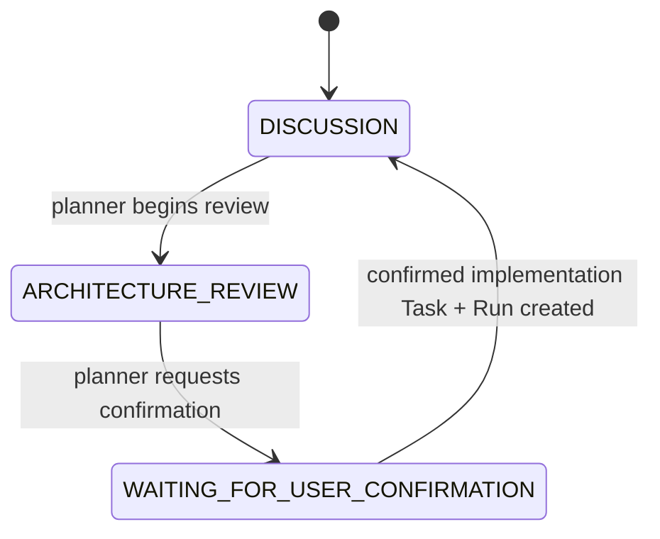
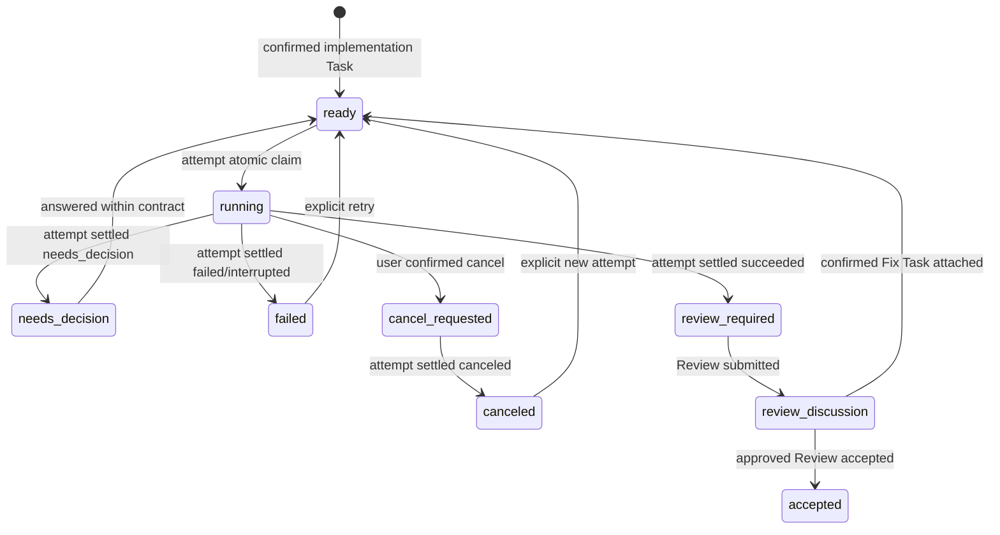
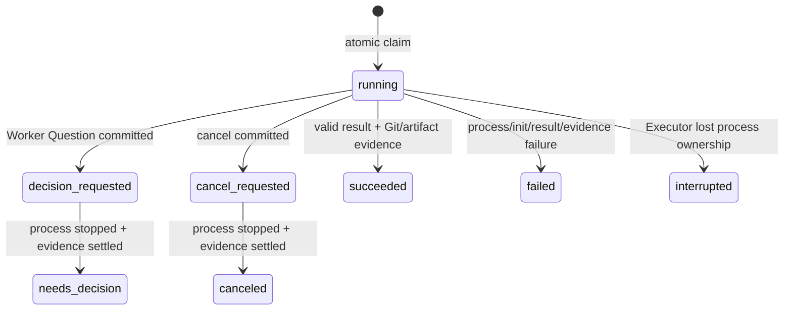

# Stage 2 Execution Core Architecture Review

| 属性 | 内容 |
|---|---|
| 文档状态 | Approved / Implementation pending |
| Owner | Codex |
| 评审人 | 用户、Codex、Claude Code（实现可执行性） |
| 创建日期 | 2026-08-30 |
| 生效范围 | Agent Room Stage 2 — Execution Core |
| 关联材料 | [v0.3 路线图](./AGENT_ROOM_V03_ROADMAP.md)、[ADR-0003](./ADR/0003-participant-role-and-v03-evolution.md)、[Proposed ADR-0004](./ADR/0004-execution-core-run-attempt-and-concurrency.md)、[Increment 10 Accepted Contract](./INCREMENT_10_TASK_CONTRACT.md) |

## 1. 结论

Stage 2 应把 Current `Run` 拆为稳定的逻辑 `Run` 与一次 process invocation 对应的 `RunAttempt`，并把执行、Question、failure、Review 和 acceptance 状态从全局 `Room.state` 下沉到具体 `Run`。`Room.state` 只保留单一 planning artifact 的讨论与确认阶段；snapshot 通过 `run_work_items` 同时展示多个 Run 的等待角色。

该拆分是 same-Room multi-Run 的必要条件。Current implementation 以全局 `Room.state`、最新 `task_submitted`/`run_completed` Event 和单一 `current_run` 判断全部 lifecycle；若只放宽 `run_already_active`，Run A 的 Question、failure 或 Review 会改变整个 Room 状态并错误阻塞 Run B。

本 Review 推荐：

1. 使用 fresh `0.4-design` SQLite database，不原地改写 active `0.3-design` database；v0.3 与既有 v0.2 database 均只读保留。
2. Stage 2 交付显式 one-shot Execution Core、atomic claim、multiple Runs、cancel/new attempt 与唯一 attempt settlement；不交付自动 Scheduler、DAG 或 Git Controller。
3. 一个未接受 Run 独占一个 canonical worktree；多个 Run 只有使用不同 worktree 才能同时拥有 active attempt。
4. `WorkerAdapter` 只验收 `claude_code_cli`；provider-neutral Executor 不等于其它 provider 已可用。
5. Claude Code `-p` 没有已验收的 live steer channel，因此 guidance 只允许在没有 active attempt 时保存，并注入下一 attempt；running guidance 请求必须拒绝。

用户已于2026-08-30先确认以上三项Architecture Decision，随后确认[Increment 10 Contract](./INCREMENT_10_TASK_CONTRACT.md)全文并将其标记为`Accepted`。之后用户分别授权planning Room transition与clean planning baseline：active runtime仍是v0.3，durable Room现为`WAITING_FOR_USER_CONFIRMATION`且没有Task；`room_submit_task`与Claude Run仍未授权。

## 2. 当前事实与问题

### 2.1 Current authority

| 事实 | Current owner | 代码事实 |
|---|---|---|
| Room lifecycle | `rooms.state` | `RoomService.applyTransition` 是唯一写入点 |
| current Task/Run/Review/Question | Room 内最新对应 Event | `state-snapshot.ts` 返回单一 `current_*` |
| 一次 Claude process 与 terminal evidence | `Run` | `Run`同时保存 process、session、Git evidence、artifact 与 terminal status |
| claim | `startRun` / `resumeRun` | claim 创建 `Run` 并把整个 Room 转为 `CODING` |
| Question/failure/review | 全局 Room transition | 任一 Run 都会把整个 Room转为`NEEDS_DECISION`、`RUN_FAILED`或`REVIEW_REQUIRED` |
| worktree | `room:run --project` 与 Run baseline | 只支持当前 project worktree，无 same-Room worktree ownership模型 |

### 2.2 必须解决的失败

如果仅允许创建多个 Current-shape `Run`：

- Run A 进入 `NEEDS_DECISION` 后，Run B 无法继续合法 terminal transition；
- 最新 `run_completed` 只能表示一个“current Run”，其它成功 Run不能独立 Review；
- `room_retry_run(room_id)`无法确定重试哪个 Run；
- 两个 Executor可以对同一 Run或同一 worktree重复 claim；
- cancellation 与 terminal callback可能竞争并产生二次 settlement；
- current `Run`没有稳定逻辑 lineage与单次 process attempt 的边界。

因此 Stage 2 不是删除 single-active guard，而是替换 execution state ownership。

## 3. 目标、非目标与约束

### 3.1 目标

- 一个 Room MUST 同时保存多个相互独立的逻辑 Run。
- 每个 Run MUST 包含一个或多个顺序 `RunAttempt`；每个 attempt 对应恰好一个 Worker process invocation。
- claim MUST 原子冻结 Run/Attempt authority、worktree、baseline 和 attempt number。
- 同一 Run MUST 至多有一个 non-terminal attempt；同一 canonical worktree MUST 至多被一个未接受 Run占用。
- Question、failure、cancel、Review 和 acceptance MUST 只改变目标 Run及其 attempt。
- terminal settlement MUST first-writer-wins；相同 payload retry幂等，不同 payload冲突且无副作用。
- Provider-neutral Executor MUST 通过 frozen Worker `adapter_id` 调用 adapter；Stage 2 只实现并验收 Claude Code adapter。

### 3.2 非目标

- TaskGraph、Plan、Approval、dependency、priority、scope conflict与automatic Scheduler。
- Git Controller、worktree/branch创建、commit、merge、push或自动清理。
- 两个 Run并行修改同一 worktree。
- 新 provider adapter、adapter discovery/registry、remote Worker或automatic model routing。
- running Claude process的live guidance/steer、free Worker chat或automatic Fix。
- VS Code Cockpit、SSE、GitHub Provider、remote/multi-user deployment。
- v0.3 database原地migration、dual-read/dual-write或长期compatibility route。

### 3.3 术语

| 术语 | 定义 |
|---|---|
| `Run` | 一条已批准 Implementation lineage；包含初始 Task、后续 Fix Task及全部 attempts，拥有稳定worktree/baseline/session lineage |
| `RunAttempt` | 一次被Executor claim并启动的Worker process；拥有不可变task、worker、executor、worktree、baseline与terminal evidence |
| active attempt | status为`running`、`decision_requested`或`cancel_requested`的attempt |
| worktree owner | status尚未`accepted`的Run；其已冻结worktree不能被另一Run claim |
| guidance | planner保存、仅注入下一attempt prompt的结构化文本；不是对running process的live input |

## 4. 状态所有权

### 4.1 Room planning state

`Room.state`只拥有单一 planning artifact 的确认阶段：



Fix Task 不占用 Room planning state。它只能在目标 Run=`review_discussion`、引用该 Run current Review且`confirmed_by_user=true`时提交，原子附着到同一 Run并把 Run转为`ready`。

### 4.2 Run state



`accepted` 是 Run 的唯一完成终态。`failed`、`needs_decision`与`canceled`保留 evidence并等待人工决定，不自动重试。

### 4.3 RunAttempt state



Terminal attempt states为`succeeded|failed|needs_decision|canceled|interrupted`。terminal fields一经写入 MUST immutable。

### 4.4 Waiting actor read model

单一 `waiting_actor` 不再能表达 multi-Run。`room_get_state` MUST 返回：

```yaml
planning_waiting_actor: planner | user
run_work_items:
  - run_id: string
    run_status: string
    waiting_actor: worker | executor | reviewer | user | planner | null
    current_task: TaskContract
    current_attempt: RunAttempt | null
    current_question: Question | null
    current_review: Review | null
```

`run_work_items`按`Run.created_at`、`run_id`稳定排序；它是read model，不是第二权威。

## 5. 数据模型

### 5.1 Task

Target `TaskContract`新增required `run_id`：

- `type=implementation`：`run_id`必须尚不存在；Task与ready Run在同一transaction创建。
- `type=fix`：`run_id`必须引用existing `review_discussion` Run；`based_on_review_id`必须属于该Run current successful attempt。
- existing Task same-ID retry仍先按冻结planner identity认证，再区分same content与`id_conflict`。

### 5.2 Run

```yaml
run_id: string
room_id: string
root_task_id: string
status: ready | running | cancel_requested | needs_decision | failed | canceled | review_required | review_discussion | accepted
worker_participant_id: string
worktree_path: string | null
baseline_head: string | null
created_at: timestamp
updated_at: timestamp
accepted_at: timestamp | null
```

Worker在initial Run创建时按Task scope优先、Room fallback解析并冻结；assignment replacement只影响后续Run。

### 5.3 RunAttempt

```yaml
attempt_id: string
run_id: string
room_id: string
task_id: string
attempt_no: integer
status: running | decision_requested | cancel_requested | succeeded | failed | needs_decision | canceled | interrupted
worker_participant_id: string
executor_participant_id: string
worktree_path: string
baseline_head: string
agent_session_ref: string | null
process_exit_code: integer | null
started_at: timestamp
settled_at: timestamp | null
result: CodingResult | null
git_evidence: GitEvidence
artifact_refs: [string]
failure: RunFailure | null
```

`attempt_no`由服务端按Run递增分配；caller只提供fresh `attempt_id`。首次attempt冻结Run的canonical worktree和baseline；后续attempt必须逐字段继承，caller不得覆盖。

### 5.4 Question、Review 与 Guidance

- `Question`新增required `attempt_id`，且`run_id/task_id/attempt_id` membership必须一致。
- `Review`新增required `attempt_id`，只能引用目标Run最新succeeded attempt。
- 新增`RunGuidance`：`guidance_id`、`room_id`、`run_id`、`text`、planner identity、`created_at`、nullable `consumed_by_attempt_id`。只有无active attempt时可创建；claim下一attempt时原子标记consumed并加入prompt。

## 6. 并发与隔离

### 6.1 Atomic claim

Executor claim在一个SQLite transaction中 MUST：

1. 认证enabled executor及Run frozen worker；
2. 校验Run为`ready`且无active attempt；
3. 首次attempt对目标worktree执行clean/HEAD observation，后续attempt只读验证exact frozen path与baseline；
4. 校验canonical worktree未被其它未接受Run占用；
5. 服务端分配`attempt_no`，创建running attempt；
6. 将Run改为`running`，消费pending guidance并追加`run_attempt_claimed` Event。

process spawn在claim提交后发生。startup/MCP init failure通过同一attempt terminal settlement进入failed，不回滚已成立的claim事实。

### 6.2 SQLite并发约束

Stage 2 schema SHOULD 保留JSON content作为完整entity表示，但 MUST 增加支持真实并发查询的projection columns/index：

| 约束 | SQLite enforcement |
|---|---|
| per-Run attempt序号唯一 | `UNIQUE(run_id, attempt_no)` |
| per-Run至多一个active attempt | partial unique index on `run_id` where attempt status is non-terminal |
| canonical worktree至多一个未接受owner | partial unique index on `runs.worktree_path` where path non-null and Run status != `accepted` |
| Room Event顺序 | existing `UNIQUE(room_id, sequence)` |

service guard提供稳定domain error；unique constraint是两个process同时通过read guard时的最终Oracle。constraint failure必须映射为`run_already_active`或`worktree_already_owned`，不得泄漏raw SQLite error。

### 6.3 Worktree边界

- Stage 2不创建、切换或删除worktree；operator/Stage 3提供path。
- canonicalization使用Git observer确认的repository root，不使用caller字符串作为ownership key。
- 不同Run共享同一repository但指向不同Git worktree时允许并行。
- 一个未接受Run即使处于failed/needs_decision/canceled/review，也继续拥有其worktree，避免另一Run接管dirty Diff。
- Run accepted后worktree lease释放；新的Run仍必须通过clean gate，因此不会把未提交accepted Diff误当作clean execution input。

## 7. Executor 与 WorkerAdapter

```text
room:run / future Scheduler
        │ explicit run_id + attempt_id + worktree
        ▼
Local Executor
  ├─ atomic claim / cancellation observation / single settlement
  └─ WorkerAdapter
       └─ ClaudeCodeWorkerAdapter
            ├─ existing Claude process transport
            └─ existing Claude stream interpreter
```

`WorkerAdapter`最小接口只表达本阶段真实consumer：execute Task、resume opaque session、emit progress、respond to AbortSignal并返回normalized outcome。Stage 2不增加dynamic registry；Executor只接受`adapter_id=claude_code_cli`，其它adapter以`worker_adapter_unavailable`在claim前拒绝且零RunAttempt/Event/artifact。

process lifetime改为per-attempt；session lifetime保持per-Run。Fix、Decision resume与retry使用latest reliable non-empty `agent_session_ref`；不存在时只允许failure retry创建replacement session，Decision/Fix仍要求可恢复session。

## 8. Public commands

### 8.1 保留但改变语义

| Command/tool | Target语义 |
|---|---|
| `room_get_state` | 返回Room planning state、全部Runs/Attempts及`run_work_items`，不再返回单一current Run authority |
| `room_submit_task` | implementation原子创建Task+ready Run并让Room回到`DISCUSSION`；fix附着existing Run并让Run回到`ready` |
| `room_retry_run` | input增加`run_id`；只把目标failed/canceled Run转为ready，不影响其它Run |
| `room_answer_question` | 只改变Question所属Run；contract内答案让该Run ready，scope变化只进入Room planning confirmation且不影响其它Run |
| `room_submit_review` | Review必须引用run_id+attempt_id，只改变目标Run |
| `room_accept_review` | 只把目标Run转为accepted，不终止Room |
| `room_ask_question` | Question绑定run_id+attempt_id；把attempt转为decision_requested，不改变其它Run |

### 8.2 新增

| Command/tool | Caller | 成功语义 |
|---|---|---|
| `room_add_run_guidance` | planner | 无active attempt时保存guidance，下一attempt claim原子消费 |
| `room_cancel_run` | planner | `confirmed_by_user=true`时把目标active attempt与Run标记cancel_requested；Executor终止process后settle canceled |
| `claimRunAttempt` | executor application boundary | 原子创建一个running attempt并冻结execution context；不作为planner MCP tool |
| `settleRunAttempt` | frozen executor application boundary | first-writer-wins写入唯一terminal outcome、evidence及Run projection |

running `room_add_run_guidance`返回`validation_failed`，提示使用cancel + new attempt；不得持久化一个Claude Code无法消费的live steer artifact。

## 9. SQLite 与 protocol version

### 9.1 推荐 cutover

- Target protocol metadata exact为`0.4-design`。
- 创建fresh `room-v0.4.sqlite`与new Room identity；不原地改写`room-v0.3.sqlite`。
- binding把单值`archived_database_path`替换为稳定有序`archived_database_paths`，至少保留v0.2与v0.3 absolute paths；active database不得出现在archive list。
- v0.4 writable service遇到v0.3/v0.2 database MUST 在任何schema write前以`protocol_version_mismatch`拒绝。
- setup rerun MUST 复用同一v0.4 identity，不创建第二database/Room。

当前active v0.3 Room没有Task/Run/Review/Question，因此fresh cutover不需要业务entity migration；Participant/Assignment按v0.4 bootstrap重新创建。若用户要求保留v0.3 Room identity或entity，必须另行设计migration，不能由Claude自行选择。

### 9.2 表变化

- `rooms.state`替换为planning-only enum。
- `tasks` target content增加`run_id`。
- `runs`从attempt evidence容器改为logical lineage，并增加可索引projection columns。
- 新增`run_attempts`与`run_guidance`表。
- `reviews`与`questions`增加attempt reference。
- `events.entity_type`增加`run_attempt|run_guidance`。
- 不增加Plan、Approval、TaskGraph或Git operation表。

## 10. Event contract

Stage 2 MUST 至少产生：

| Event | Entity | Atomic write |
|---|---|---|
| `run_created` | run | implementation Task + ready Run + Room回DISCUSSION |
| `run_attempt_claimed` | run_attempt | attempt + Run running + guidance consumption |
| `run_attempt_progress` | run_attempt | Event only，attempt必须active |
| `question_asked` | question | Question + attempt decision_requested |
| `run_attempt_needs_decision` | run_attempt | terminal evidence + Run needs_decision |
| `run_attempt_failed` | run_attempt | terminal evidence + Run failed |
| `run_attempt_succeeded` | run_attempt | terminal evidence + Run review_required |
| `run_cancel_requested` | run | Run/attempt cancel_requested |
| `run_attempt_canceled` | run_attempt | terminal evidence + Run canceled |
| `run_guidance_added` | run_guidance | guidance entity |
| `review_submitted` | review | Review + Run review_discussion |
| `review_accepted` | review | Review acceptance + Run accepted |

Event继续记录raw `participant_id + actor_role`，只引用structured entity，不复制Task、result或Diff。

## 11. 失败语义

| Failure | 必须行为 |
|---|---|
| 同一Run并发claim | 一个成功；其余`run_already_active`且完整snapshot无新增attempt/Event |
| 不同Run claim同一worktree | 一个成功；其余`worktree_already_owned`且零副作用 |
| Worker adapter不可用 | claim前`worker_adapter_unavailable`，零attempt/process/Event/artifact |
| process startup/MCP init失败 | claimed attempt唯一settle failed；只改变目标Run |
| cancellation与success/failure竞争 | 第一个terminal settlement持久化；后续相同payload幂等、不同payload `id_conflict` |
| Executor crash且process outcome未知 | 显式recovery把active attempt settle interrupted；不得手工标success |
| Run A Question/failure/review | Run B entity、status、attempt、Event reference逐字段不变 |

## 12. Verification matrix

| ID | 场景 | 直接入口 | Oracle | 失败后决定 |
|---|---|---|---|---|
| S2-01 | implementation Task创建ready Run | `room_submit_task` MCP | Task+Run+Events同transaction；Room回DISCUSSION | 修复Task/Run creation boundary |
| S2-02 | 同Run双claim | 两个SQLite service connection并发`claimRunAttempt` | 恰好一个active attempt；loser零写入 | 修复transaction/index，不交付 |
| S2-03 | 同worktree双Run claim | 两个Run并发claim | 恰好一个owner；稳定`worktree_already_owned` | 修复canonical path/index，不交付 |
| S2-04 | 不同worktree双Run | two-process fake Worker E2E | 两个attempt时间重叠且Room/Event/Run无串扰 | 修复Executor isolation，不交付 |
| S2-05 | terminal race | settle success/failure/cancel并发 | 恰好一个terminal Event与immutable evidence | 修复settlement owner，不交付 |
| S2-06 | Question isolation | Worker MCP public path | A needs_decision；B仍running并可progress/settle | 修复per-Run state ownership |
| S2-07 | failure/retry isolation | `room_retry_run(run_id)` | 只重置A；B snapshot逐字段不变 | 修复targeted command |
| S2-08 | Review/Fix lineage | MCP + fake Worker E2E | Review绑定attempt；Fix在同Run新attempt并复用session/baseline | 修复reference/lineage |
| S2-09 | cancel | `room_cancel_run` + fake process | cancel request、process stop、唯一canceled settlement | 修复Abort/settlement |
| S2-10 | guidance | `room_add_run_guidance` | idle时下一attempt消费一次；running时零写入拒绝 | 修复真实consumer boundary |
| S2-11 | adapter boundary | non-Claude worker assignment | claim前stable error、零side effect；Claude adapter E2E通过 | 修复adapter selection |
| S2-12 | v0.4 cutover | setup/serve public CLI | v0.2/v0.3 bytes不变、v0.4 rerun identity稳定 | 修复binding/version gate |
| S2-13 | full regression | `npm test` | Stage 1 identity/authority与新版serial lifecycle保持 | 只修复task-owned regression |

## 13. 发布、回滚与开发隔离

Stage 2会修改正在协调自身开发的protocol、schema、Runner、CLI与Plugin Skill。Implementation/Fix必须由固定planning baseline的detached v0.3 launcher worktree驱动current v0.3 Room和target main worktree；candidate不得覆盖launcher代码。

推荐顺序：

1. 用户确认本Architecture Review、ADR-0004与完整Task Contract。
2. 单独授权提交planning documentation baseline并处理当前dirty config/plugin文件。（已授权，本轮执行）
3. 单独授权创建detached v0.3 launcher worktree与临时local binding更新。
4. 通过current v0.3 Room提交一次Accepted Task并执行一次获批one-shot Run。
5. 完整Review/Fix/接受/版本化后，另行确认v0.4 database/binding cutover。

任何阶段都不删除旧database；cutover失败时恢复原v0.3 binding并继续使用未改写的v0.3 database。

## 14. 风险与待确认项

| 类型 | 内容 | 影响 | Owner | 状态 |
|---|---|---|---|---|
| Decision | fresh `0.4-design` database、new Room与`archived_database_paths`，不原地migration v0.3 | 决定schema/cutover与binding contract | 用户 | Confirmed 2026-08-30 |
| Decision | Stage 2只交付显式one-shot multi-Run core，Scheduler/worktree创建仍留Stage 3 | 阻止阶段越界 | 用户 | Confirmed 2026-08-30 |
| Decision | guidance仅在下一attempt消费，running guidance拒绝 | 不声明未验证的Claude live steer能力 | 用户 | Confirmed 2026-08-30 |
| Risk | Stage 2涉及protocol/storage/Runner/MCP/Plugin central wiring，不适合拆成并行leaf | 并行会造成共享schema与entrypoint冲突 | Codex | Mitigated：单一串行Task |
| Risk | canceled/failed/review中的Run持续占有worktree | 防止dirty worktree被另一Run接管；可能长期占用 | 用户/Codex | Accepted 2026-08-30 |

## 15. Architecture Review decision

`approved`。三项Decision与完整Increment 10 Contract均已获用户确认；Contract为`Accepted`且`confirmed_by_user=true`。durable Room已按授权推进到`WAITING_FOR_USER_CONFIRMATION`，clean planning baseline正在形成；`room_submit_task`与Claude Run仍未授权，不得进入Coding。
