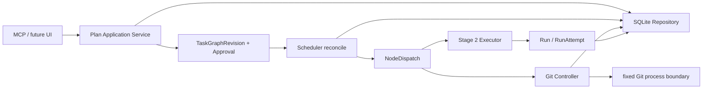
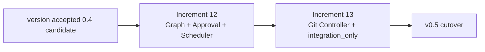

# Stage 3 DAG Control Plane Architecture Review

| 属性 | 内容 |
|---|---|
| 文档状态 | Approved |
| Owner | Codex |
| 评审人 | 用户、Codex、Coding task（实现可执行性） |
| 创建日期 | 2026-09-01 |
| 用户确认日期 | 2026-09-01 |
| 生效范围 | Agent Room Stage 3 — DAG Control Plane |
| 关联材料 | [v0.3路线图](./AGENT_ROOM_V03_ROADMAP.md)、[Stage 2 Architecture Review](./STAGE_2_EXECUTION_CORE_ARCHITECTURE_REVIEW.md)、[ADR-0004](./ADR/0004-execution-core-run-attempt-and-concurrency.md)、[ADR-0005](./ADR/0005-remove-git-baseline-hash-validation.md)、[ADR-0006](./ADR/0006-stage-3-dag-control-plane-and-git-controller.md) |

## 1. 结论

Stage 3不应重建Stage 2的Execution Core。它应在已接受的baseline-free `Run`/`RunAttempt`、atomic claim、canonical worktree lease和per-Run Review lifecycle之上增加四个边界：

1. `Plan`保存一条稳定规划lineage；`TaskGraphRevision`保存不可变DAG内容。
2. `Approval`精确引用某个revision或某次Git preview；批准事实不回写或覆盖artifact内容。
3. `Scheduler`只消费已批准revision，确定性地产生ready node并物化既有`Task + Run`；它不启动Agent process，也不执行Git write。
4. `Git Controller`是product内唯一Git write boundary；每次动作都必须先生成preview、取得用户对该preview的明确确认，再至多执行一次。

用户已确认把Stage 3拆成两个可独立Review的Increment：

- Increment 12：Plan/immutable revision/Approval、DAG validation、structured write scope、ready scheduling、`per_task` acceptance和existing-worktree dispatch；不执行Git write。
- Increment 13：managed worktree、Git Controller与`integration_only` acceptance；Git操作只支持`create_worktree`、`commit_paths`和`integrate_fast_forward`。

用户已确认把accepted Increment 10/11 source与Stage 3 planning形成clean、versioned `0.4-design` source baseline但不切换active v0.3 runtime；该版本化由本次提交完成。Stage 3将在该baseline上开发fresh target `0.5-design`，完成整个Stage 3后只进行一次runtime/database/binding cutover。Architecture Decision已收口，当前Review Decision为`approved`；[Increment 12 Contract](./INCREMENT_12_TASK_CONTRACT.md)已获全文确认并为`Accepted`，Coding task创建仍需独立授权。

## 2. 证据边界

### 2.1 已确认事实

- Active project runtime仍是versioned protocol `0.3-design`；其terminal Room不能复用为Stage 3 planning Room。
- Increment 10/11 accepted source已由本次提交进入版本化`main`；active runtime/database/binding仍为v0.3，未cutover。
- Candidate exact source基线为`c449f40aebe3ff018610c59f34782a698463f907`，当前task-owned candidate Diff实现protocol `0.4-design`且删除runtime Git hash validation。
- Candidate已经提供logical `Run`、per-process `RunAttempt`、atomic claim、不同canonical worktree的multi-Run、per-Run Question/Review/Fix/acceptance、live staged/unstaged/untracked evidence和provider-neutral Executor边界。
- Current role enum已经包含`git_controller`；Stage 1冻结其兼容条件为`adapter_id=local_runner`且capability=`git_control`，但bootstrap不创建该assignment，也不存在Git write consumer。
- `Plan`、Plan-scope Assignment和`Approval`此前明确延后到Stage 3的首个真实consumer。
- [ADR-0005](./ADR/0005-remove-git-baseline-hash-validation.md)禁止用file hash、Diff fingerprint、branch mirror或timestamp token替代已删除的baseline validator；historical commit evidence不是runtime hash validation。

### 2.2 本次不声明的事实

- `0.5-design`已确认为Stage 3 target，但实现、版本化和cutover前不是Current protocol。
- 本Review不表示Stage 3 schema、MCP tool、Scheduler或Git Controller已经实现。
- 本Review不授权stage、commit、branch/worktree创建、runtime cutover、database创建/迁移、Agent task创建或process启动。
- `gpt-5.6-sol`/`medium`只记录为未来Coding route；没有Accepted Contract和独立task创建授权时不得派发。

## 3. 目标、非目标与核心invariant

### 3.1 目标

- 用户能够创建并修订一条有向无环Task Graph，明确dependency、write scope、Worker assignment、priority、concurrency `1..3`和acceptance policy。
- Scheduler只从exact approved revision派生ready work，不读取聊天文本、Draft或旧revision作为authority。
- 已dispatch或已进入running/review/completed lifecycle的Task Contract不因Plan amendment而改变。
- 两个无dependency且write scope不冲突的node可以在不同canonical worktree并行；冲突node必须有dependency顺序，不能强制并行。
- 任何Git write都经过exact preview和用户确认；Scheduler、Worker、Reviewer及普通Executor均不能绕过Git Controller。
- crash、retry或stale preview不能造成Git operation自动重放。

### 3.2 非目标

- background daemon、automatic Agent launch、automatic retry、automatic review/fix/merge或free Worker chat。
- push、fetch/pull、rebase、reset、clean、force operation、merge commit、冲突自动解决、worktree/branch自动删除。
- GitHub、remote worker、machine-level Room Hub、VS Code Cockpit或跨repository DAG。
- file hash、Diff fingerprint、commit hash precondition或其它replacement validator。
- 在Stage 3首个Increment同时交付全部Graph、Git和integration policy能力。

### 3.3 Authority invariant

| 事实 | 唯一owner | 不得替代它的来源 |
|---|---|---|
| Plan lineage | `Plan` | Chat、Markdown摘要、latest Task |
| graph内容 | immutable `TaskGraphRevision` | 可变Plan row、Scheduler内存 |
| 用户批准 | `Approval` + Event | caller布尔值之外的模型自述 |
| node物化与worktree绑定 | `NodeDispatch` | latest Event猜测、CLI参数 |
| execution/review | existing `Run` / `RunAttempt` / `Review` | graph status副本 |
| source与Diff | live Git worktree | saved patch、hash、Room代码镜像 |
| Git write intent/result | `GitAction` + live Git process result | Scheduler或Worker直接shell |

## 4. 目标组件与依赖方向



依赖约束：

- `Scheduler`依赖Plan read model和Stage 2 application commands，不依赖MCP/CLI presentation。
- `Scheduler`不能调用WorkerAdapter、spawn process或Git CLI；它只物化Task/Run、维护NodeDispatch并返回ready work。
- `Git Controller`不能修改Task/Run/Review decision；它只校验已批准GitAction、执行固定allowlist command并结算result。
- Git process boundary使用argument array且不经过shell；operation和参数来自typed application input，不接受任意subcommand/argv。
- State Machine和schema不读取filesystem或Git。

## 5. 数据模型

### 5.1 Plan

```yaml
plan_id: string
room_id: string
created_by_participant_id: string
created_at: UTC timestamp
```

一个Room首版至多有一个active Plan lineage。Plan不保存`current_revision_id`或可变DAG内容；当前approved revision由该Plan最新成功`task_graph_revision_approved` Event唯一推导。

### 5.2 TaskGraphRevision

```yaml
revision_id: string
plan_id: string
room_id: string
revision_no: positive integer
supersedes_revision_id: string | null
concurrency_limit: integer 1..3
acceptance_policy: per_task | integration_only
nodes:
  - node_id: string
    kind: task | integration
    task_spec: TaskSpec
    dependencies: [node_id]
    write_scopes:
      - path: repo-relative POSIX path
        kind: file | tree
    worker_assignment_id: string
    priority: integer
created_by_participant_id: string
created_at: UTC timestamp
```

Revision insert后完整immutable。Draft amendment不是修改旧row，而是创建`revision_no + 1`的新revision；旧revision、Approval、NodeDispatch和Run历史均保留。

`TaskSpec`使用预分配的`task_id`和`run_id`，保存`TaskContract`的全部业务字段、`created_by=codex`与冻结`created_at`，但不包含`confirmed_by_user`。这是必要的Draft/Accepted分离：Draft revision不能满足Current `TaskContract`要求的确认literal。批准exact revision后，Scheduler物化时只补入`confirmed_by_user=true`形成正式`TaskContract`，不得改写goal、scope、requirements、verification或其它业务字段。

### 5.3 Approval

```yaml
approval_id: string
room_id: string
target_type: task_graph_revision | git_action_preview
target_id: string
decision: approved | rejected
confirmed_by_user: true
planner_participant_id: string
created_at: UTC timestamp
```

Approval是immutable decision fact。相同ID/相同content retry返回existing；相同ID/异content为`id_conflict`。同一target已有terminal decision后不得创建相反decision；要改变Draft内容必须创建新revision或新preview。

### 5.4 RoleAssignment

Stage 3把`scope_type`从`room|task`扩展为`room|plan|task`。解析优先级为exact task > exact plan > room。Revision中的`worker_assignment_id`引用批准时仍active且兼容的exact Assignment；批准后replacement不改写已批准revision或已物化Run。

Stage 3首版只让graph直接选择Worker assignment。Reviewer与Executor继续按Stage 2既有task/room规则解析；没有真实需求时不为每个node增加重复role map。

### 5.5 NodeDispatch

```yaml
dispatch_id: string
revision_id: string
node_id: string
task_id: string
run_id: string
worktree_path: string | null
status: waiting | awaiting_git | ready | dispatched | blocked | completed
created_at: UTC timestamp
updated_at: UTC timestamp
```

`UNIQUE(revision_id, node_id)`保证Scheduler reconcile不重复物化。NodeDispatch只保存graph与existing Task/Run/GitAction的reference和worktree binding；execution/review状态仍由Run拥有。

### 5.6 GitAction

```yaml
git_action_id: string
room_id: string
revision_id: string
node_id: string
operation: create_worktree | commit_paths | integrate_fast_forward
preview:
  repository_root: absolute path
  source_branch: string | null
  target_branch: string | null
  worktree_path: absolute path | null
  paths: [repo-relative path]
  commit_message: string | null
  room_event_cursor: non-negative integer
status: previewed | approved | executing | succeeded | failed | outcome_unknown
result:
  command_exit_code: integer | null
  resulting_commit_id: string | null
  message: string | null
created_at: UTC timestamp
settled_at: UTC timestamp | null
```

`resulting_commit_id`只记录Git返回的historical evidence，不作为后续runtime validator或preview precondition。GitAction不保存Diff副本、content hash或patch mirror。

## 6. Graph validation与Amendment

批准revision前在单一transaction中验证：

1. Plan/Room/reference membership一致，`revision_no`连续且`supersedes_revision_id`指向该Plan上一revision。
2. `node_id`、`task_id`、`run_id`在revision内唯一；所有dependency存在，不允许self-edge或cycle。
3. `concurrency_limit`在`1..3`，priority为integer，`integration_only`存在exact一个terminal integration node。
4. 每个write scope使用canonical repo-relative POSIX语法；禁止absolute path、empty、`.`/`..` traversal和glob。
5. 任意两个scope重叠的node必须存在dependency reachability顺序；无序重叠直接拒绝revision approval。
6. Assignment存在、属于同Room、role=`worker`、participant enabled且adapter/capability兼容。
7. Amendment对已经存在NodeDispatch的node必须保持完整node content不变；只能新增、删除或修改尚未dispatch的node，并且不能移除已dispatch node的ancestor关系。

Revision validation失败时，不创建Approval、NodeDispatch、Task、Run或Event。

### 6.1 Room planning state与Contract materialization

Stage 3继续使用Stage 2 planning-only Room state，但确认对象从单个Implementation Task提升为exact revision：

```text
DISCUSSION
→ ARCHITECTURE_REVIEW
→ WAITING_FOR_USER_CONFIRMATION
→ approved/rejected revision decision
→ DISCUSSION
```

Target `0.5-design`不再允许planner通过public `room_submit_task`创建新的Implementation Run；单Task使用one-node revision表达。`room_submit_task`只保留`type=fix`，继续把Fix挂入既有`review_discussion` Run。

Scheduler也不能循环调用Stage 2 public `room_submit_task`：该入口拥有Room confirmation transition，重复调用会把同一次revision Approval误变成每node确认。Stage 3新增internal `materializeApprovedGraphNode` application boundary，复用Stage 2的Task/Run identity、assignment、idempotency和transaction invariants，但把confirmation source固定为exact revision Approval，并且不改变Room planning state。

`answer_changes_contract=true`不得修改原node或恢复同一Run。用户确认scope变化后创建amendment：原node/Run保持历史事实并取消或维持blocked，新revision使用fresh node/task/run IDs加入replacement node；只有尚未dispatch的descendant可以rewire。已有dispatch descendant时必须new Plan，不能改写其ancestor Contract。

## 7. Write scope conflict model

不复用`TaskContract.scope: string[]`做机器判断。该字段是人类可读Contract scope；Stage 3新增结构化`write_scopes`：

- `kind=file`只声明exact file。
- `kind=tree`声明该path及其全部descendant；repository root使用`path="."`。
- 两个file同path、file位于tree内、两个tree相同或祖先/后代时视为overlap。
- path separator统一为`/`，比较使用repository-relative normalized component，不按字符串前缀误判`src/a`与`src/ab`。

三层门禁：

1. revision approval拒绝无dependency顺序的overlap node；
2. Scheduler/claim transaction再次拒绝与active attempt重叠的scope，覆盖并发race和amendment；
3. attempt成功后把live staged/unstaged/untracked path与declared scope比较。越界不改写Coding Result，也不自动清理；NodeDispatch标记`blocked`，Git Controller拒绝commit，Reviewer决定Fix或amendment。

## 8. Scheduler semantics

Scheduler使用显式one-shot `reconcilePlan(plan_id)`，不是background loop。每次调用：

1. 读取latest approved revision；没有Approval时返回零ready item。
2. 按priority降序、revision node顺序、`node_id`字典序形成确定性候选顺序。
3. dependency满足、node未物化且scope不与active attempt冲突时，在`BEGIN IMMEDIATE` transaction内创建NodeDispatch并调用`materializeApprovedGraphNode`；该窄入口复用Stage 2 Task/Run creation invariants，但不重复Room confirmation transition。
4. existing worktree已由operator选择且clean时可进入`ready`；managed worktree没有successful GitAction时进入`awaiting_git`。
5. Executor claim在同一transaction内再次验证revision仍为current approved、node未blocked、Room active attempt数量小于`concurrency_limit`且scope无冲突。
6. reconcile只返回ready Runs；Codex/人工operator仍须对每个one-shot Run单独授权。Scheduler不调用`room:run`、WorkerAdapter或Codex task API。

Dependency满足条件：

- `per_task`：所有直接dependency Run均为`accepted`。
- `integration_only`：非integration dependency已经由Reviewer给出`approved` Review，按用户预先批准的policy转为Run `accepted`并完成所需`commit_paths`；terminal integration node仍须显式用户接受。

Question、failure、cancel或Review只阻塞目标node及其descendants；无dependency且scope不冲突的branch继续可调度。

## 9. Acceptance policy

### 9.1 `per_task`

- 每个node沿用Stage 2 Review lifecycle。
- Reviewer提交`approved`后Run仍为`review_discussion`；用户逐Run调用acceptance command。
- Run=`accepted`后dependency才满足。
- Plan在全部terminal node accepted后完成。

### 9.2 `integration_only`

- Revision必须包含exact一个`kind=integration`的terminal node，且所有其它terminal path最终到达它。
- 用户批准revision时即预先授权：非integration node的Review Decision=`approved`后，Scheduler可把该Run推进为`accepted`，作为integration candidate；这不是Git授权。
- 每个candidate的`commit_paths`仍需独立Git preview与用户确认；所有candidate operation成功后integration node才ready。
- Integration Run仍执行正常Review，且只有用户显式接受后Plan完成。
- Revision一旦有任何NodeDispatch，acceptance policy不可由amendment改变；需要不同policy时创建new Plan。

该policy复用existing Run accepted终态，不增加`candidate_accepted`平行状态。Plan是否整体完成由graph终端条件推导，不把单个Run accepted误写成main integration已完成。

## 10. Git Controller

### 10.1 唯一写边界

只有持有active `git_controller` Assignment、`adapter_id=local_runner`与capability=`git_control`的enabled participant可以执行GitAction。Worker、Reviewer、Scheduler和普通Executor不得调用Git process mutation方法。

首版allowlist：

| Operation | 作用 | 明确排除 |
|---|---|---|
| `create_worktree` | 从用户确认的named source branch/ref创建named branch与worktree | 不切换现有worktree、不删除branch/worktree |
| `commit_paths` | 只stage preview列出的declared-scope paths并创建Conventional Commit | 不使用`git add .`、不包含越界path、不amend |
| `integrate_fast_forward` | 在clean target worktree对named source branch执行`--ff-only` integration | 不merge commit、不冲突解决、不rebase、不force |

Commit message必须符合本项目Conventional Commits规则，并进入preview供用户确认。

### 10.2 Preview与执行

```text
create preview（只读Git observation）
→ user confirms exact preview
→ persist Approval
→ reserve GitAction=executing
→ execute fixed operation once
→ settle succeeded / failed / outcome_unknown
```

执行前重新观察repository root、named branches、worktree path和staged/unstaged/untracked path set；Room Event cursor或这些structured facts与preview不一致时返回`git_preview_stale`，要求生成新preview。不得通过commit hash、file hash、Diff fingerprint、saved patch或timestamp判断staleness。

该选择保留一个已确认取舍：若文件内容变化但path集合、branch name和Room cursor均未变化，Controller不能自动检测；cooperating operator必须在preview后停止编辑并立即确认/执行。若未来要求immutable source revision，必须重新Architecture Review ADR-0005，而不是静默加入hash字段。

### 10.3 External side effect crash gap

Git process与SQLite transaction不能原子提交。GitAction在执行前持久化`executing`；process返回后结算：

- 明确成功：`succeeded`并记录result evidence/Event。
- 明确非零退出：`failed`，保留stderr摘要与live Git状态，不自动retry。
- process ownership丢失或service crash后重启：`outcome_unknown`；不得再次执行相同GitAction。只允许read-only reconcile并由用户决定创建新preview、接受现状或人工恢复。

## 11. Public application commands

Stage 3 target新增application/MCP boundary：

| Command | Role | 成功语义 |
|---|---|---|
| `room_create_plan` | planner | 创建stable Plan identity；不创建Revision/Approval/Task/Run |
| `room_create_plan_revision` | planner | 创建immutable Draft revision；不创建Approval/Task/Run |
| `room_decide_plan_revision` | planner + `confirmed_by_user=true` | 原子验证revision并创建Approval/Event |
| `room_reconcile_plan` | orchestrator | 物化当前approved revision的eligible NodeDispatch/Task/Run；不spawn/Git write |
| `room_preview_git_action` | git_controller | 只读观察并保存typed preview |
| `room_decide_git_action` | planner + `confirmed_by_user=true` | 为exact preview创建Approval；不执行Git |
| `executeGitAction` | git_controller application boundary | reserve后至多执行一次固定Git operation；不作为Worker tool |
| `room_get_state` | assigned participant | snapshot增加Plan/revision/Approval/NodeDispatch/GitAction数组和derived graph work items |

Draft/revision creation、approval、reconcile和Git execution的same-ID retry/conflict均沿用“先认证stored authority，再比较完整structured content”的既有规则。

Target command change：`room_submit_task`只接受`type=fix`并继续服务既有Run；新的Implementation Task只能由approved revision经internal `materializeApprovedGraphNode`创建。这样single-node与DAG共用一套approval/scheduling authority，不保留第二条direct Implementation通道。

## 12. SQLite与query contract

Fresh target增加：`plans`、`task_graph_revisions`、`approvals`、`node_dispatches`、`git_actions`。继续以`content_json`保存完整entity，并为真实并发/查询增加projection column；不做分库、cache或migration framework。

| Query ID | 场景 | 必要projection/index |
|---|---|---|
| `Q-PLAN-01` | 取得Plan latest approved revision | `events(room_id, sequence)` + target reference |
| `Q-REV-01` | 验证revision number/lineage | `UNIQUE(plan_id, revision_no)` |
| `Q-SCHED-01` | 判断node是否已物化 | `UNIQUE(revision_id, node_id)` |
| `Q-SCHED-02` | 统计Room active attempts | 复用`run_attempts(status, room_id)` projection/index |
| `Q-SCHED-03` | 找到Run对应declared scopes | `node_dispatches(run_id)` unique/index |
| `Q-GIT-01` | 取得exact preview与execution状态 | `git_actions(git_action_id)` primary key |
| `Q-APPROVAL-01` | 取得target terminal decision | `UNIQUE(target_type, target_id)` |

关键transaction：

- revision approval：full DAG/assignment/amendment validation + Approval + Event。
- scheduler materialization：eligibility recheck + NodeDispatch + existing Task/Run create + Events。
- attempt claim：Stage 2 claim + plan concurrency/scope recheck。
- Git approval：preview current check + Approval + GitAction status。
- Git reserve/settle：只覆盖SQLite lifecycle；外部Git side effect按§10.3处理。

## 13. Failure semantics

| Failure | 必须行为 |
|---|---|
| cycle/missing dependency | revision approval `validation_failed`；零Approval/Dispatch/Task/Run/Event |
| unordered overlapping scopes | revision approval `scope_conflict`；零副作用 |
| amendment修改已dispatch node | `immutable_revision_violation`；旧revision与运行中Contract不变 |
| Draft被Scheduler读取 | 返回零ready item，不创建任何execution entity |
| reconcile并发物化同一node | 一个成功；其余same result或稳定conflict，`UNIQUE(revision_id,node_id)`无duplicate |
| concurrency达到上限 | node保持waiting/ready，不claim、不spawn |
| active scope race | claim loser `scope_conflict`，完整snapshot无attempt/Event/artifact |
| actual Diff越界 | target node blocked；Review可继续，GitAction拒绝，不自动清理 |
| Git preview未确认/已stale | 零Git process invocation、零Git mutation |
| Git command非零 | GitAction failed，保存evidence，不自动retry |
| Git outcome未知 | GitAction outcome_unknown，禁止自动重放，等待read-only reconcile和用户决定 |
| integration `--ff-only`失败 | 保持source/target worktree与branches；不尝试merge/rebase/冲突解决 |

## 14. Protocol、版本化与cutover建议

Stage 3改变schema、MCP tools、snapshot、RoleAssignment scope、Task submission source和Git write boundary，不能作为`0.4-design`的无版本additive patch。用户确认：

1. 先以独立Git授权把已接受Increment 10/11 candidate版本化，形成clean `0.4-design` source baseline；不必先切换active runtime。
2. Stage 3 target使用fresh `0.5-design` database/new Room；v0.2/v0.3 databases继续只读归档，未cutover的v0.4 candidate database不作为迁移输入。
3. Increment 12/13均完成Review和用户接受后，再独立授权一次v0.5 database/binding cutover。
4. active v0.3 runtime在cutover前继续是Current；Draft本身不修改runtime、binding或terminal Room。

选择先cutover v0.4再开发Stage 3也可行，但会产生两次fresh Room/binding切换而没有当前运营收益；除非用户需要先实际使用Stage 2 multi-Run，否则不推荐。

## 15. Increment拆分与依赖



### 15.1 Increment 12 candidate scope

- `Plan`、immutable `TaskGraphRevision`、generic `Approval`的revision consumer。
- Plan-scope Assignment、structured write scopes、cycle/missing/conflict/amendment validation。
- deterministic reconcile、NodeDispatch、existing-worktree ready scheduling、claim concurrency/scope gate。
- `per_task` acceptance、snapshot/MCP/Status/Plugin planning workflow。
- 不含Git process mutation、managed worktree或`integration_only`。

### 15.2 Increment 13 candidate scope

- `git_controller` assignment/bootstrap decision与fixed Git process boundary。
- GitAction preview/approval/single execution/unknown outcome recovery。
- managed worktree、`commit_paths`、`integrate_fast_forward`。
- `integration_only` acceptance与terminal integration node。
- 不含push/rebase/reset/clean/delete/conflict resolution/automatic merge。

每个Increment都需独立完整Accepted Task Contract、clean exact baseline、Coding task创建授权、Diff Review、用户接受和Git提交授权。

## 16. Verification matrix

| ID | 场景 | 直接入口 | 独立Oracle | 失败后决定 |
|---|---|---|---|---|
| S3-01 | cycle/missing dependency | revision approval MCP | literal graph；完整snapshot deepEqual | 修复validator，不交付 |
| S3-02 | immutable amendment | approval + dispatched node fixture | old revision/node/Task/Run逐字段不变 | 修复lineage guard |
| S3-03 | unordered scope overlap | revision approval | literal file/tree component compare | 修复scope grammar |
| S3-04 | reconcile idempotency/race | two SQLite connections | oneNodeDispatch/Task/Run/Event set | 修复transaction/index |
| S3-05 | dependency branch isolation | Question/failure on node A | descendants blocked；unrelated B ready/claimable | 修复scheduler projection |
| S3-06 | concurrency `1..3` | concurrent public claims | active attempts不超过approved limit | 修复claim gate |
| S3-07 | scope race | two overlapping claims | one succeeds；loser零attempt/process/Event/artifact | 修复claim/index |
| S3-08 | actual Diff越界 | production completion + snapshot | node blocked；Git preview拒绝；worktree不清理 | 修复post-run scope audit |
| S3-09 | per-task acceptance | public Review/accept paths | dependency只在Run accepted后ready | 修复policy gate |
| S3-10 | integration-only | component Review + Git actions + integration Run | component policy preauthorization、每次Git独立确认、final user acceptance | 修复policy lifecycle |
| S3-11 | stale/unapproved preview | Git Controller public path | zero Git process；Git/SQLite snapshot不变 | 修复approval/cursor gate |
| S3-12 | Git action retry/crash | fixed fake Git process + restart | success不重放；unknown禁止retry | 修复external settlement |
| S3-13 | ff-only conflict | real temporary repository | non-zero；无merge/rebase/cleanup side effect | 收窄Git Controller |
| S3-14 | no hash replacement | schema/source/public snapshot | 无baseline/hash/fingerprint/branch-mirror validator | 删除替代校验 |
| S3-15 | current capability隔离 | active v0.3 binding/status | Draft/0.5 code不改Current Room/database | 停止cutover |

## 17. Confirmed Decisions

用户于2026-09-01确认三项推荐：

1. **版本与cutover顺序**：先版本化accepted v0.4 candidate、保持v0.3 active；Stage 3使用fresh `0.5-design`，完整Stage 3接受后只cutover一次。
2. **Increment拆分**：Increment 12先交付Graph/Approval/Scheduler + `per_task`且零Git write；Increment 13再交付Git Controller + `integration_only`。
3. **首版Git operation集合**：只允许`create_worktree`、`commit_paths`、`integrate_fast_forward`；继续排除push/rebase/reset/clean/delete/merge commit/conflict resolution。

2026-09-02，用户进一步确认[Increment 13 Architecture Review](./INCREMENT_13_GIT_CONTROLLER_ARCHITECTURE_REVIEW.md)的实施细化：Git Controller使用fixed `local-runner` actor的one-shot `room:git` CLI；`integration_only`首版只允许single fast-forward lineage；完整Contract确认后使用独立Codex worktree task且保持active v0.3不cutover。用户随后确认完整[Increment 13 Contract](./INCREMENT_13_TASK_CONTRACT.md)，Contract=`Accepted`、阶段=`PLAN_READY`；Coding task创建、Git/runtime写入与cutover仍未授权。

## 18. Review Decision

`approved`

理由：核心authority、state ownership、failure boundary和最小实现顺序已经形成闭环，§17三项Architecture Decision均已由用户明确确认。Implementation仍必须经过完整Accepted Contract、clean versioned baseline、独立Coding task授权、Review与用户接受。

## 19. 验证摘要

- 代码事实：已检查accepted Increment 10/11 candidate的protocol schema、Run/RunAttempt state machine、SQLite constraints、snapshot、Executor、Git Observer和role compatibility；Stage 3设计复用这些owner，没有把Draft描述成Current implementation。
- 架构一致性：Roadmap要求的immutable revision、ready scheduling、scope conflict、concurrency `1..3`、`per_task`/`integration_only`和Git preview均有明确owner、transaction或人工门禁。
- Hash边界：没有加入baseline、file hash、Diff fingerprint、commit hash precondition、branch mirror或timestamp validator；Git result中的commit ID只作为historical evidence。
- 操作边界：本次只修改项目文档；未创建Coding task、未启动Agent/Room Run、未执行Git写入或runtime/database/binding cutover。
- documentation: updated。本Review提升为`Approved`、ADR-0006提升为`Accepted`；后续Increment 12 Contract已获全文确认并转为`Accepted`，相关状态已同步至文档中心、Project Rules、Architecture、Protocol、MVP Plan、Operations与Development Log；未把未实现Stage 3能力标记为Current。
